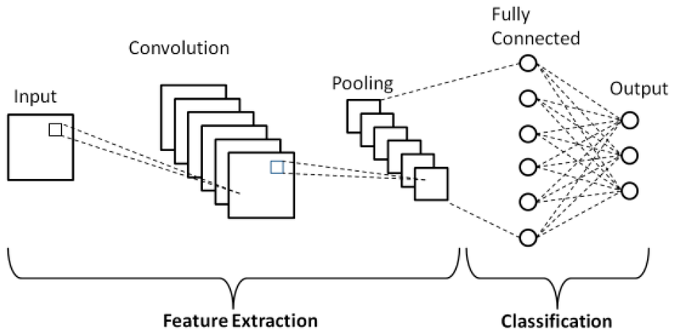

# Convolution Neural Network(CNN)

### Q1. Draw and explain CNN (Convolution Neural Network) architecture in detail. [6]

- A Convolutional Neural Network (CNN) is a type of deep learning neural network designed specifically to process structured grid data like images
- It learns to extract spatial features from input images using convolution operations, and uses these features for tasks like image classification, object detection, and recognition.



Sure! Here's your provided text rewritten in a **clean, well-formatted, and exam-ready** manner:

---

### **CNN (Convolutional Neural Network) Architecture – Explanation of Layers**

#### **i) Input Layer:**

* This layer takes an image as input.
* The image size is usually like **32 × 32 × 3** (Width × Height × RGB Channels).

---

#### **ii) Convolution Layer:**

* This is the **core building block** of CNN.
* It uses **filters/kernels** (e.g., 3×3 or 5×5 matrix) that **slide over the image** to detect patterns like **edges, textures, or shapes**.
* Each filter learns to detect a **specific feature**.
* Multiple filters can be used in one convolution layer to extract various features.

---

#### **iii) ReLU (Activation Layer):**

* ReLU stands for **Rectified Linear Unit**.
* It replaces all **negative values with 0** in the feature map.
* This adds **non-linearity** to the model and keeps only the important information.

---

#### **iv) Pooling Layer (Subsampling/Downsampling):**

* This layer **reduces the size** of the feature map.
* It selects the **maximum value** from a region (e.g., 2×2), commonly known as **Max Pooling**.
* Pooling makes the model **computationally efficient** and helps in **reducing overfitting** by retaining only the most important features.

---

#### **v) Flatten Layer:**

* This layer converts the **final feature maps into a 1D vector** (a simple list of numbers).
* It prepares the data for the Fully Connected Layer.

---

#### **vi) Fully Connected Layer:**

* Every neuron in this layer is **connected to all activations** from the previous layer.
* It combines all extracted features to **make predictions** or decisions.

---

#### **vii) Output Layer:**

* This is the **final layer** of CNN.
* It gives the **final prediction** (e.g., using **Softmax** for classification).

---

### Q2. Explain working of Convolution Layer with its features. [6]

A **Convolution Layer** is the core layer in a **Convolutional Neural Network (CNN)** that is used to extract **features** from input data (especially images) by applying **filters (kernels)**.

### **Working:**

1. **Input Image:**

   * The layer receives an input image (e.g., 32×32×3 for RGB).

2. **Filter/Kernel:**

   * A small matrix (e.g., 3×3 or 5×5) that slides over the image.
   * Each filter detects a specific feature (like edge, corner, texture).

3. **Convolution Operation:**

   * The filter slides across the image with a certain **stride**.
   * At each position, **element-wise multiplication** is done between filter and image patch, and the result is **summed up** to form one pixel of the output.
   * This results in a **feature map** (also called an activation map).

4. **Multiple Filters:**

   * CNN uses multiple filters in one layer to extract different features.
   * The output is a set of feature maps representing different detected patterns.


### ✅ **Features of Convolution Layer in CNN:**

* **Local Connectivity:**
  Each neuron is connected to only a small region of the input, helping capture spatial hierarchies.

* **Weight Sharing:**
  The same set of filters (kernels) is used across the entire input image, reducing the number of parameters.

* **Feature Extraction:**
  It extracts low-level features like edges, corners, and textures from images.

* **Translation Invariance:**
  Helps recognize features even when they shift positions slightly in the image.

* **Preserves Spatial Structure:**
  Unlike flattening layers, it retains the spatial relationship between pixels.

* **Multiple Filters:**
  Allows learning of various features simultaneously by using multiple filters.

---

### **Example:**

If a 3×3 edge-detection filter is applied to a grayscale image, the convolution operation highlights edges in that direction (e.g., vertical or horizontal lines).

---

### Q3. What is Strides in CNN? Explain in brief. [6]
(Explain stride Convolution with example. [6])

## ✅ **What is Stride in CNN?**

### 🔹 **Definition:**

In a Convolutional Neural Network (CNN), **stride** refers to the **number of pixels by which the filter (kernel) moves** over the input image during the **convolution operation**.

---

### 🔹 **Purpose of Stride:**

* To **control the spatial size** (width and height) of the output feature map.
* To **adjust computation cost**: larger strides = fewer computations.
* To reduce the resolution progressively in deeper layers.

---

### 🔹 **How It Works:**

* A **stride of 1** moves the filter **one pixel at a time**, covering every position.
* A **stride of 2** moves the filter **two pixels at a time**, skipping positions in between.


### 🔹 **Example:**

Let’s take a **5×5 input image** and a **3×3 filter**.

* With **stride = 1**, the filter slides like:

  * Moves 1 pixel → Output size = **3×3**
* With **stride = 2**, the filter jumps 2 pixels:

  * Output size = **2×2**

---

### 🔹 **Advantages of Using Stride:**

* Controls the **reduction in size** of the image/feature map.
* Helps in **dimensionality reduction** without pooling.
* **Speeds up** training and inference time.

---

### Q4. Explain Pooling layers and its types with examples. [6]
(Explain Pooling Layer with its need and different types. [6]
| Explain all the features of pooling layer. [6] )


### ✅ **Definition:**

* A **Pooling Layer** in a Convolutional Neural Network (CNN) is used to **reduce the spatial size** (width and height) of the feature maps.
* It summarizes regions, which helps in **dimensionality reduction** and **retains important features**.
* It works by summarizing or compressing information from small regions (usually 2×2 or 3×3 windows) of the feature map.
* These windows slide across the feature map using a defined stride (step size)

### ✅ **Need for Pooling Layer in CNN**

The **Pooling Layer** plays a critical role in **Convolutional Neural Networks (CNNs)**. It is essential for improving performance and efficiency of the model.

### 🔹 **Reasons/Needs/features for Pooling Layer:**

1. **Dimensionality Reduction**

   * Pooling reduces the size of feature maps, which lowers the number of parameters and computations in the network.

2. **Prevention of Overfitting**

   * By reducing the number of features, pooling helps in simplifying the model, faster, simpler and reducing overfitting

3. **Improves Computational Efficiency**

   * Smaller feature maps mean faster processing and less memory usage. It improves the efficiency of the network.

4. **Dominant Feature Extraction**

   * Pooling focuses on the most important features (like edges, corners) and discards less important information.

5. **No Learning Parameters**
   * Pooling layers do not have any learnable parameters, making them computationally efficient.


### ✅ **Types of Pooling Layer in CNN**

Pooling layers are used to reduce the spatial dimensions of feature maps and extract the most important information. The most common types are:

---

### 🔹 1. **Max Pooling**

* **Definition:** Selects the maximum value from each patch of the feature map.
* **Purpose:** Captures the most prominent features like edges or textures.
* **Example:**
  For a 2×2 region:

  ```
  [2 4]     → Max = 6  
  [6 1]
  ```

---

### 🔹 2. **Average Pooling**

* **Definition:** Computes the average of the values in each patch of the feature map.
* **Purpose:** Smoothens the feature map and reduces noise.
* **Example:**
  For a 2×2 region:

  ```
  [2 4]     → Avg = (2+4+6+1)/4 = 3.25  
  [6 1]
  ```

---

### 🔹 3. **Global Max Pooling**

* **Definition:** Takes the maximum value from the entire feature map.
* **Use Case:** Often used before the output layer in classification tasks.

---

### 🔹 4. **Global Average Pooling**

* **Definition:** Averages all values from the entire feature map.
* **Use Case:** Reduces data to a single value per feature map; common in lightweight models like MobileNet.

---

### Q5. What is Padding? Enlist and explain types of padding. [6]

### ✅ **What is Padding in CNN?**

**Padding** in CNN refers to adding extra pixels (usually zeros) around the border of an input image or feature map **before applying the convolution operation**.

🔸 **Why Padding is Needed:**

* Without padding, the feature map size shrinks after each convolution.
* Without padding, every time we apply a convolution, the Output becomes smaller,so To **control the output size** of the feature map.
* To **preserve spatial dimensions** (width and height).
* To **ensure features near the borders** of the image are captured.
* Helps **keep edge and corner information** intact.

### ✅ **Types of Padding in CNN**

Padding controls the spatial size of the output feature map. There are **three main types** of padding:

---

### 1️⃣ **Valid Padding (No Padding)**

* **No extra pixels** are added to the input.
* The convolution filter **only slides within the original input image**.
* The output feature map is **smaller** than the input.
* ✅ **Example:**
  If input = 5×5 and filter = 3×3 → output = 3×3

---

### 2️⃣ **Same Padding (Zero Padding)**

* Extra pixels (usually **zeros**) are added **around the border** of the input.
* Padding is done in such a way that **output size = input size**.
* Ensures that **features at edges** are not lost.
* ✅ **Example:**
  If input = 5×5 and filter = 3×3 → output = 5×5

---

### 3️⃣ **Full Padding**

* Padding is added so that the filter can **slide beyond** the original input size.
* The output feature map is **larger** than the input.
* Used in rare cases for **edge-sensitive** tasks.
* ✅ **Example:**
  If input = 5×5 and filter = 3×3 → output = 7×7

---

### Q6. Explain ReLU Layer in detail. What are the advantages of ReLU over Sigmoid? Explain disadvantages of ReLU [6]

Here's a complete **exam-ready answer** for:

---

## ✅ **ReLU Layer in CNN**

### 🔹 **What is ReLU?**

ReLU stands for **Rectified Linear Unit**.
It is an **activation function** used in CNNs after the convolution operation.


### 🔹 **Definition:**

ReLU is defined as:

$$
f(x) = \max(0, x)
$$

* If the input is **positive**, ReLU returns it as is.
* If the input is **negative**, ReLU outputs **0**.

---

### 🔹 **Purpose of ReLU Layer:**

* Introduces **non-linearity** into the model.Without an activation function like ReLU, the network would behave like a linear model, no matter how many layers it has.
* The ReLU function converts all negative values to zero and keeps positive values as they are.
* This helps the model to focus only on strong, useful signals and ignore weaker ones.
* Helps the network **learn complex patterns**.
* Makes training **faster and more efficient**.

---

### 🔹 **Example:**

If the input feature map is:

`[[-2, 3], [0, -1]]`

After applying ReLU:

`[[0, 3], [0, 0]]`

---

### Advantages of ReLU over Sigmoid

* **Simplacity**
   * ReLU is simpler to compute than Sigmoid.
   * Sigmoid has an expensive exponential calculation.

* **Speed**

  * ReLU is faster to compute as it involves simple thresholding at zero.
  * Sigmoid is slower due to expensive exponential calculations.

* **Non-linearity**

  * ReLU introduces strong non-linearity which helps in learning complex patterns.
  * Sigmoid has weaker non-linearity and can saturate at extremes.

* **Vanishing Gradient Problem**

  * ReLU reduces the vanishing gradient problem, enabling deeper networks.
  * Sigmoid suffers from vanishing gradients, slowing down learning in deep networks.

* **Sparsity**

  * ReLU produces sparse activations (many zeros), which improves efficiency.
  * Sigmoid outputs are always positive and dense, less efficient.

* **Convergence**

  * ReLU leads to faster convergence during training.
  * Sigmoid typically results in slower convergence.


## ✅ **Disadvantages of ReLU:**

1. **Dying ReLU Problem**

   * Sometimes, neurons **output zero permanently** and stop learning (when input is always negative).

2. **Not Zero-Centered**

   * ReLU outputs are always positive, which can cause **asymmetric updates** in the network.

3. **Unbounded Output**

   * ReLU can output unbounded values, which can cause instability in training.

4. **Not suitable for all tasks**
   * ReLU is not suitable for tasks that require negative outputs or values close to zero.


---

### Q7. Explain Dropout Layer in Convolutional Neural Network. [6]

### Dropout Layer in CNN

* **Definition:**
  Dropout is a **regularization technique** used in CNNs to prevent the model from **overfitting** during training.

* **What is Dropout?**
  During each training step, some neurons are **randomly turned off** (i.e., ignored).
  These neurons **do not participate** in the forward pass (making predictions) or backward pass (updating weights).

* **Why use Dropout?**
  This helps the network become more **robust** and prevents it from becoming too **dependent on specific neurons**.

* Placement in CNN
  Dropout layers are usually placed **after fully connected layers**, but can also be used after convolutional layers in complex CNN architectures.
---

### Working of Dropout Layer

1. During training, each neuron has a **probability $p$** of being **kept active** (e.g., 0.5, 0.8).
2. The remaining neurons with probability $1-p$ are **randomly set to zero** (dropped out) for that training step.
3. At the next training step, **different neurons** may be dropped out randomly.
4. During testing (inference), dropout is **turned off** (no neurons are dropped), but outputs are **scaled** to match the average activations during training.

### Advantages of Dropout

* **Prevents Overfitting:**
  Forces the model to not rely too much on any single neuron.

* **Simple & Efficient:**
  Easy to implement and adds **no extra parameters**, only randomness.

* **Encourages Robust Feature Learning:**
  Since neurons are randomly dropped, the network learns **multiple different paths**, making it more stable.

---


### Q8. Explain Local response normalization and need of it. [6]

Here is your **pointwise answer** for **Local Response Normalization (LRN)** using the provided theory:

---

### ✅ **What is Local Response Normalization (LRN)?**

* LRN is a technique used in CNNs to **normalize the output of neurons**, making the learning process more **stable and effective**.
* It is inspired by the concept of **lateral inhibition** from neuroscience.
* The goal is to make **strongly activated neurons stand out** while **suppressing weaker** or less important nearby neurons.
* This encourages the network to **focus on important features** and ignore noise or unimportant signals.

---

### 📌 **Need for LRN**

1. **Stabilizes Training**

   * After ReLU, neuron outputs can become very large or vary too much.
   * LRN reduces this variation to stabilize training.

2. **Improves Generalization**

   * It helps the network generalize better by reducing the effect of **large activations** and **promoting diversity** in neuron outputs.

3. **Controls Neuron Activity**

   * LRN controls the **relative activity** of neurons, making it easier for the network to learn and generalize.

4. **Enhances Feature Focus**

   * It helps the network **focus on specific features** by suppressing less important ones.

---

### ✅ **Working of Local Response Normalization (LRN) – 4 Points:**

1. **Applies Across Channels:**
   LRN normalizes the activation of a neuron using the activations of its neighboring channels (depth-wise).

2. **Suppresses Nearby Activations:**
   Strongly activated neurons inhibit the activation of nearby neurons, creating competition.

3. **Formula-Based Normalization:**
   Each neuron’s response is divided by a factor that depends on the square sum of its neighboring neuron activations.

4. **Highlights Important Features:**
   This mechanism boosts the most relevant features and dampens less useful ones, improving model focus.

---

### Q9. What are the applications of Convolution with examples? [6]

### ✅ **Applications of Convolution (in CNN)**

1. **Edge Detection**

   * **Use**: Detecting boundaries in images.
   * **Example**: Using Sobel or Prewitt filters to highlight edges.

2. **Image Blurring / Smoothing**

   * **Use**: Removing noise or softening an image.
   * **Example**: Gaussian Blur using a 3×3 or 5×5 smoothing filter.

3. **Satellite Image analysis**

   * **Use**: CNNs can process high - resolution satellite images and extract features like roads, buildings, etc.
   * **Example**: CROP monitoring, Urban planning. 

4. **Text Recognition**

    * **Use**: Extracting text from images or scanned documents.
    * **Example**: OCR (Optical Character Recognition) using CNNs.

5. **Medical Imaging**

   * **Use**: Identifying tumors, lesions, or abnormalities.
   * **Example**: Detecting cancerous cells in MRI or CT scans using CNNs.

6. **Object Detection**

   * **Use**: Identifying and locating objects in images.
   * **Example**: YOLO (You Only Look Once) or Faster R-CNN models.

7. **Facial Recognition**

   * **Use**: Recognizing or verifying individuals based on facial features.
   * **Example**: Face ID on smartphones.CNN filters learning to detect eyes, nose, mouth in face recognition.

8. **Self-driving Cars**

   * **Use**: Understanding surroundings via camera input.
   * **Example**: Lane detection, traffic sign recognition using convolutional layers.

