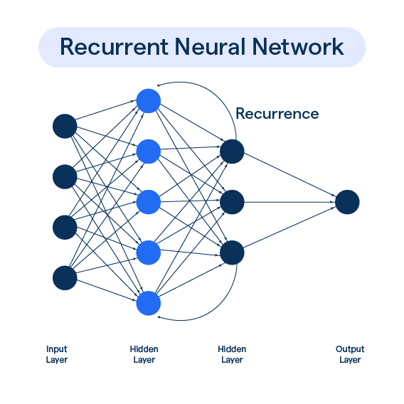
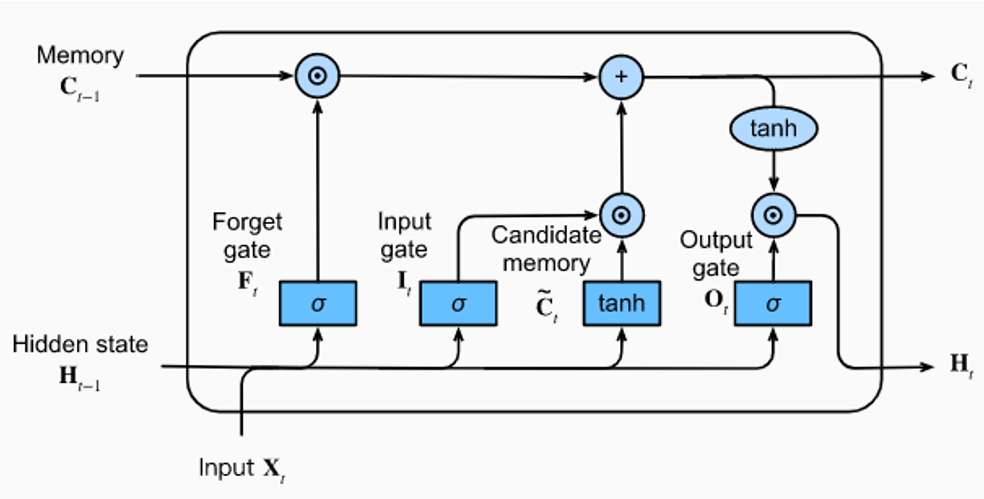
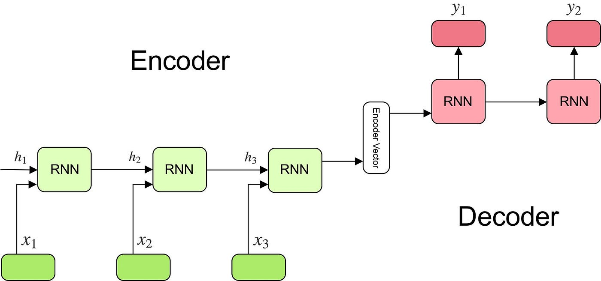

# Recurrent Neural Networks

### Q1. Explain Unfolding computational graphs with example. [5]

### ✅ **Unfolding Computational Graphs**

---

### 🔹 **What is a Computational Graph?**

* A **computational graph** is a visual representation of the series of operations performed on inputs (like numbers, vectors, etc.) to produce an output.
* Each **node** in the graph represents an **operation** (e.g., addition, multiplication).
* Each **edge** represents the **data** (values or tensors) flowing between operations.

---

### 🔹 **What is Unfolding?**

* **Unfolding a computational graph** means expanding a **repeated operation** (like in a loop or sequence) into a full series of operations across **individual time steps**.
* It’s like **“unrolling” a loop** to visualize what happens at each step.

---

### 🔹 **Where is it used?**

* Most commonly used in **Recurrent Neural Networks (RNNs)**.
* In RNNs, the **same operation** is repeated at each **time step**, so unfolding helps visualize and understand the process.

---

### 🔹 **Example: Word-by-word Processing in RNN**

Suppose we are processing a sentence word-by-word using an RNN.

At each time step `t`, the RNN takes:

* The input at time step `t` → $x_t$
* The hidden state from the previous step → $h_{t-1}$
* It uses a **shared function** $f$ to produce the new state → $h_t = f(x_t, h_{t-1})$

---

### 🔹 **Original Loop (Compact Form):**

$$
h_t = f(x_t, h_{t-1})
$$

---

### 🔹 **Unfolded Form (2 Time Steps):**

* **Time Step 1**: $h_1 = f(x_1, h_0)$
* **Time Step 2**: $h_2 = f(x_2, h_1)$

Each step is a **copy of the same function $f$**, but applied to different inputs at each time step.

---

### 🔹 **Why Unfolding is Important:**

* Helps in visualizing how data flows through time.
* Essential for **Backpropagation Through Time (BPTT)**.
* Makes it easier to debug, understand, and optimize recurrent architectures.

---

### Q2. Explain Recurrent Neural Network with its architecture. [6]
(What is RNN? What is need of RNN? Explain in brief about working of
RNN (Recurrent Neural Network). [6] AND Explain RNN with its types. [6])

## 🔁 **Recurrent Neural Network (RNN)**

### 📌 **Definition**

* An RNN is a type of neural network designed to handle **sequential data** such as:
 Text Audio Time-series data, etc.
* Unlike traditional neural networks (like **CNN** or **feedforward networks**) which process inputs **independently**, RNNs have **memory** of previous inputs.
* RNNs can "remember" what they’ve seen before and use that information to make **better predictions**.
* The output of the **previous step** is fed back into the network as an **input for the next step**.
* It is widely used in NLP, speech recognition, time-series prediction, etc.

### 📊 **Architecture**

1. **Input Layer:** Accepts input data as a sequence, one step at a time.
2. **First Hidden Layer:** Processes input data using weighted connections and activations.
3. **Second Hidden Layer:** Receives input and maintains memory using recurrent connections.
4. **Recurrent Connections:** Allow the network to remember past information through hidden states.
5. **Output Layer:** Produces the final output from the last hidden layer.

### ⚙️ **Working of RNN**

RNN processes data one step at a time, using a **hidden state** to pass information forward.

At **each time step**, the RNN:

1. Takes the **current input** $x_t$
2. Takes the **previous hidden state** $h_{t-1}$
3. Computes a **new hidden state** $h_t$
4. Optionally, produces an **output** $y_t$

---

### 🔄 **Step-by-Step Flow**

1. **Start** with an initial hidden state $h_0$ (usually zeros)
2. **Input Step 1**:

   * Feed the first element of the sequence $x_1$ into the RNN
   * Compute $h_1 = f(x_1, h_0)$
3. **Input Step 2**:

   * Feed the second input $x_2$ with the previous hidden state $h_1$
   * Compute $h_2 = f(x_2, h_1)$
4. **Continue** this process for all sequence elements
5. The final output can be generated:

   * At **each time step** (for tasks like translation)
   * Or **only at the end** (for tasks like sentiment classification)

---

### Need of RNN
1. **To process sequential data** like text, audio, or time series where order of input matters.
2. **To maintain memory of previous inputs** using hidden states for better context understanding.
3. **To enable contextual learning,** allowing predictions based on past information.
4. **To handle variable-length inputs** efficiently, unlike traditional feedforward networks.
5. **To reuse weights across time steps,** making the model simpler and more efficient.
6. **To support tasks like language modeling,** machine translation, and speech recognition.

### Types of RNN

### 🔹 **1. One-to-One:**

* Single input → single output (like traditional neural networks).
* No memory of previous inputs.
  *Example: Image classification.*

### 🔹 **2. One-to-Many:**

* Single input → sequence of outputs.
* It uses memory to generate a sequence of outputs.
  *Example: Music generation from a single note.*

### 🔹 **3. Many-to-One:**

* Sequence of inputs → single output.
* It uses memory to consider the entire sequence.
  *Example: Sentiment analysis of a sentence.*

### 🔹 **4. Many-to-Many:**

* Sequence of inputs → sequence of outputs.
* It has same length inputs and outputs.
  *Example: Language translation (e.g., English to French).*

### 🔹**5.LSTM (Long Short-Term Memory):**
* Special type of RNN that can remember information for long periods.
* It has a memory cell that can store and retrieve information.
  *Example: Language translation, speech recognition, etc.*

---

### How to train RNN

🔹 **1. Prepare sequential data**
🔹 **2. Build RNN model (RNN/LSTM/GRU)**
🔹 **3. Forward pass through time steps**
🔹 **4. Compute loss**
🔹 **5. Backpropagation Through Time (BPTT)**
🔹 **6. Update weights using optimizer**
🔹 **7. Repeat for multiple epochs**

---

### Q3. Draw and explain architecture for Long Short-Term Memory (LSTM).[6]

### What is LSTM in Deep Learning?

**LSTM (Long Short-Term Memory)** is a special type of **Recurrent Neural Network (RNN)** that is capable of learning long-term dependencies. Unlike traditional RNNs, LSTMs can remember information for long periods by using gates to control the flow of information.

### **LSTM Architecture Components**

#### **1. Input ($X_t$)**

* Data at the current time step.
* Combined with previous hidden state to compute gate values.

#### **2. Hidden State ($H_{t-1}$, $H_t$)**

* Represents output at each time step.
* Carries information from previous steps.

#### **3. Memory / Cell State ($C_{t-1}$, $C_t$)**

* Long-term memory.
* Updated over time using gates.

---

### **Main Gates in LSTM**

#### **4. Forget Gate**

* Decides what to discard from previous memory.

#### **5. Input Gate**

* Decides what new information to store in memory.

#### **6. Candidate Memory**

* Creates new potential content to be added to memory.

#### **7. Memory Update**

* Combines retained old memory and new information.

#### **8. Output Gate**

* Decides what part of memory becomes the output (hidden state).

---

### Q4. what is Bidirectional LSTM, How LSTM and Bidirectional LSTM works.[6]

### **What is Bidirectional LSTM?**

A Bidirectional LSTM (BiLSTM) is an advanced version of LSTM that processes the input sequence in both forward and backward directions. This helps the model understand context from both past and future time steps.

---

### **How LSTM Works (Unidirectional)**

* A standard LSTM processes input **in one direction only**, typically from past to future.
* At each time step, it:

  * Takes the **current input** and **previous hidden state**.
  * Updates its **cell state** (memory) and produces a **new hidden state**.
* This helps capture **long-term dependencies** in the forward direction.

---

### **How Bidirectional LSTM Works**

* A Bidirectional LSTM uses **two LSTM layers**:

  1. **Forward layer**: Reads the sequence from **start to end**.
  2. **Backward layer**: Reads the sequence from **end to start**.
* Both layers generate their own hidden states at each time step.
* The outputs from both directions are **combined** (concatenated or summed).
* This allows the model to have information from **both previous and upcoming inputs**, giving better context and performance.

---

### **Benefits of Bidirectional LSTM**

* Captures **context from both directions**.
* More powerful in understanding meaning in sequences.
* Useful in **NLP tasks**, like Named Entity Recognition (NER), where both left and right context matter.

Sure! Here's your **Bidirectional LSTM** example in a clean, pointwise format:

---

### **Bidirectional LSTM – Example**

**Example Sentence:**
"He went to the bank to deposit money."

**Ambiguity:**
The word **"bank"** could mean either a **riverbank** or a **money bank** if only the left context is seen.

**Forward Context Only:**
Looking at just “He went to the bank” might cause confusion.

**Backward Context Helps:**
Seeing “to deposit money” makes it clear that **"bank"** refers to a **money bank**.

**Conclusion:**
Bidirectional LSTM uses both past (left) and future (right) context, leading to more accurate understanding and predictions.

---

### Q5. Explain how the memory cell in the LSTM is implemented computationally?

### **Memory Cell in LSTM: Computational View**

The **memory cell** in an LSTM stores long-term dependencies and is updated at every time step using the following **gates** and **operations**:

---

### **1. Inputs Used:**

* $X_t$: Current input
* $H_{t-1}$: Previous hidden state
* $C_{t-1}$: Previous memory (cell state)

---

### **2. Gates Involved:**

Each gate uses a **sigmoid activation** to output values between 0 and 1.

#### **a. Forget Gate ($F_t$)**

* Decides **what part of old memory to forget**.
* Computed using:

  * Current input $X_t$
  * Previous hidden state $H_{t-1}$

#### **b. Input Gate ($I_t$)**

* Decides **what new information to store** in the memory.

#### **c. Candidate Memory ($\tilde{C}_t$)**

* Proposes **new content** to be added.
* Uses **tanh** activation.

---

### **3. Memory Update:**

* The new memory cell state $C_t$ is updated using:

  * Old memory (filtered by forget gate).
  * New candidate memory (filtered by input gate).

---

### **4. Final Cell State Computation:**

* *Multiplication* and *addition* are element-wise.
* This updated memory $C_t$ is passed to the next time step.

---

### **5. Output Gate ($O_t$)**

* Decides **what part of the memory** to output as the hidden state.
* Final output hidden state $H_t$ is:

---

### Q6. Explain Encoder-Decoder Sequence to Sequence architecture with its application. [6]

Here’s a clear explanation of **Encoder-Decoder (Sequence to Sequence) architecture** based on the diagram you provided — suitable for exams:

---

## 🌐 **What is Encoder-Decoder (Seq2Seq)?**

**Encoder-Decoder in Deep Learning**

* The Encoder-Decoder is a type of neural network architecture designed for tasks where both the input and output are sequences, but their lengths may differ.

* **Example:** Translating an English sentence into French.

* It is commonly used in tasks like: Machine Translation, Text Summarization, Speech Recognition, Dialogue Systems

* The architecture consists of three main parts:

1. **Encoder:** Converts the input sequence into a meaningful internal representation.
2. **Encoded Vector:** A fixed-length summary vector that holds the encoded information of the input.
3. **Decoder:** Uses the encoded vector to generate the output sequence step-by-step.

## 🧠 **Architecture Explanation**

### 1. **Encoder (Left Side)**

* Takes input sequence $x_1, x_2, x_3$
* Passes them through RNN units sequentially
* At each time step:

  * Produces a hidden state:
    $h_1, h_2, h_3$
* Final hidden state $h_3$ → becomes the **Encoder Vector (context)**
  This vector summarizes the entire input sequence.

---

### 2. **Decoder (Right Side)**

* Takes **Encoder Vector** as initial input
* Predicts output sequence $y_1, y_2, y_3$
* Uses RNNs again:

  * Each output is predicted based on the previous output and hidden state.

---

### 🔄 Flow Summary:

* **Input:** $x_1, x_2, x_3$
* **Encoder Outputs:** $h_1, h_2, h_3$ → Encoded Vector
* **Decoder Inputs:** Encoder Vector + previous outputs
* **Outputs:** $y_1, y_2, y_3$

---

## 🎯 **Applications of Seq2Seq**

1. **Machine Translation:** English → French (e.g., "I love you" → "Je t’aime")
2. **Text Summarization:** Long articles → short summary
3. **Chatbots:** Convert user query → response
4. **Speech Recognition:** Audio sequence → text
5. **Question Answering:** Convert question → answer sequence

---

### Q7. Differentiate between Recurrent and Recursive Neural Network. [5]

| **Aspect**                             | **Recurrent Neural Network (RNN)**                              | **Recursive Neural Network (RecNN)**                                       |
| -------------------------------------- | --------------------------------------------------------------- | -------------------------------------------------------------------------- |
| **Data Type**                          | Works on sequential data like sentences, time series            | Works on hierarchical or structured data like parse trees                  |
| **Structure**                          | Linear chain structure where information is passed sequentially | Tree-like structure combining inputs hierarchically                        |
| **Computation**                        | Processes input step-by-step in a temporal sequence             | Applies the same neural unit recursively over tree nodes                   |
| **Output Dependency**                  | Output at each step depends on previous hidden state and input  | Output at each node depends on the combined representations of child nodes |
| **Training Method**                    | Trained using Backpropagation Through Time (BPTT)               | Trained using Backpropagation Through Structure (BPTS)                     |
| **Hidden State / Node Representation** | Keeps a hidden state updated at each time step                  | Combines node representations using a fixed function at each node          |
| **Neural Units**                       | Commonly built using LSTM or GRU units                          | Built using the same neural unit recursively applied over tree nodes       |
| **Common Applications**                | Machine Translation, Speech Recognition, etc.                   | Sentiment Analysis, Natural Language Understanding, etc.                   |

---

### Q8. What are default baseline models? Explain in brief. [5]

* Default baseline models are simple models that we create and evaluate before trying complex models like RNN, CNN, etc.

* These models act as a starting point or reference to compare how much better (or worse) our advanced models are performing.

* A baseline model usually involves basic rules or simple algorithms that require little or no learning. They are easy to implement and provide a minimum expected performance level.

**Purpose:**

* To have a clear reference for evaluating new, more complex models.
* To ensure that complex models actually add value beyond these simple approaches.

**Examples:**

* Predicting the most frequent class in classification.
* Predicting the mean or median value in regression.
* Using the last observed value as a forecast in time series.

### Types of Default Baseline Models:

1. **Majority Class Baseline:** Always predicts the most frequent class (for classification).
2. **Mean/Median Baseline:** Predicts the average or median target value (for regression).
3. **Random Baseline:** Makes random predictions based on target distribution.
4. **Last Value Baseline:** Uses the last observed value as prediction (for time series).
5. **Rule-Based Baseline:** Uses simple handcrafted rules or heuristics.

---

### Q9. What are Echo State Networks? Explain in brief. [5]

**Definition:**
ESNs are a special type of RNN designed to simplify training and handle long-term dependencies in sequences.

**Training:**
Only the output layer is trained; the Reservoir (hidden part) remains fixed.

**Reservoir:**
A large, randomly connected network of neurons that processes input.

**Echo Effect:**
Input passing through the Reservoir creates complex patterns or "echoes" over time.

**Dependency Capture:**
These echoes help capture both short-term and long-term dependencies.

**Prediction:**
The trained output layer uses the reservoir’s dynamic patterns to make predictions.

**Memory:**
The Reservoir retains memory of past inputs by transforming them into high-dimensional patterns.

---

### Q10. Explain **Leaky Units**

**Definition:**
Leaky Units are special RNN units designed to help the network remember information over different time scales.

**Working:**
They slowly update their state instead of fully replacing it at every time step — hence the term *"leaky."*

**Memory Retention:**
This behavior allows the network to retain past information longer, helping it learn both short- and long-term patterns.

**Issue in Normal RNNs:**
Standard RNN units update memory completely with new input, often forgetting older information too quickly.

**Solution:**
Leaky Units combine a portion of the old state with the new one, enabling the network to "leak" past knowledge into future steps.

**Advantage:**
They improve sequence learning by balancing memory freshness and long-term retention.

---

### Q11. **RNN on Performance Metrics**

1. **Accuracy:**
   Measures the proportion of correct predictions over total predictions.

2. **Loss Function (e.g., Cross-Entropy):**
   Quantifies the difference between predicted and actual outputs — lower loss means better model performance.

3. **Precision:**
   Indicates how many of the predicted positive outcomes are actually positive.

4. **Recall:**
   Measures how many actual positive cases were correctly predicted.

5. **F1 Score:**
   Harmonic mean of precision and recall — gives a balanced view of prediction performance.

6. **Perplexity:**
   Used in language models to evaluate how well the model predicts a sequence — lower is better.

7. **Training Time & Convergence Speed:**
   Time required for the model to learn patterns effectively — faster convergence indicates better efficiency.

8. **Gradient Stability:**
   Checks if the model suffers from vanishing or exploding gradients — affects training effectiveness in long sequences.

---

### Q12. Justify RNN is better suited to treat sequential data than a feed forward neural network. [5]

### **Why RNN is Better for Sequential Data**

1. **Remembers past inputs:**
   RNN stores previous information using hidden states.

2. **Same weights over time:**
   RNN uses shared weights across time steps for learning patterns.

3. **Works with variable-length input:**
   RNN can handle sequences of different lengths.

4. **Understands input order:**
   RNN captures the sequence and context of data.

5. **Designed for sequence tasks:**
   RNN is ideal for tasks like language, time-series, and speech.

---

### Q13. Explain Different types of Deep Learning. [5]

### **Different Types of Deep Learning**

* **Feedforward Neural Network (FNN):**

  * Data flows strictly from input to output layers without looping back.
  * It’s mainly used for simple classification and regression tasks.
  * FNNs don’t retain any memory of previous inputs.

* **Convolutional Neural Network (CNN):**

  * Designed to process grid-like data such as images by using convolutional layers.
  * CNNs capture spatial hierarchies and local patterns effectively.
  * They are widely used in image recognition, object detection, and video analysis.

* **Recurrent Neural Network (RNN):**

  * Specialized for sequential data like time series or language by maintaining hidden states.
  * RNNs remember past inputs to influence future outputs in the sequence.
  * They are useful in tasks like speech recognition and language modeling.

* **Long Short-Term Memory (LSTM):**

  * An advanced type of RNN designed to overcome vanishing gradient problems.
  * LSTM units have gates that control the flow of information, allowing long-term memory retention.
  * They are effective in tasks requiring learning from long sequences, like translation.

* **Generative Adversarial Network (GAN):**

  * Consists of two networks: a Generator that creates fake data and a Discriminator that evaluates authenticity.
  * Both networks compete, improving the Generator’s ability to produce realistic samples.
  * GANs are popular for image generation, data augmentation, and style transfer.

---

### Q14. Compare implicit and explicit memory. [6]

### **Implicit Memory vs Explicit Memory**

* **Definition:**

  * Implicit memory is unconscious and automatic recall of skills and tasks.
  * Explicit memory is conscious recall of facts and events.

* **Awareness:**

  * Implicit memory operates without awareness.
  * Explicit memory requires conscious awareness to retrieve information.

* **Types of Information:**

  * Implicit memory involves skills, habits, and conditioned responses.
  * Explicit memory involves declarative information like facts and experiences.

* **Example:**

  * Riding a bike or typing on a keyboard (implicit).
  * Remembering a birthday or historical event (explicit).

* **Brain Regions:**

  * Implicit memory mainly involves the basal ganglia and cerebellum.
  * Explicit memory primarily involves the hippocampus and medial temporal lobe.

* **Testing:**

  * Implicit memory is tested through performance tasks without direct recall.
  * Explicit memory is tested through direct questions or recall tasks.

---

