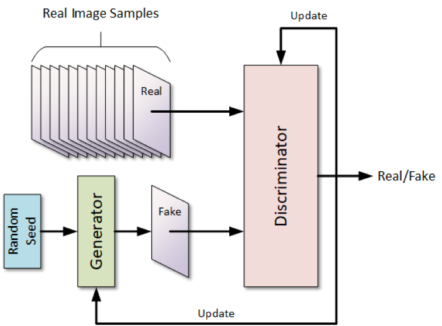

# Deep Generative Models

### Q1. Explain Deep generative model with example. [6]

### **Deep Generative Model**

* **Definition:**
  A deep generative model is a type of deep learning model that learns to generate new data samples similar to the training data.

* **How it Works:**
  It captures the probability distribution of the training data and can generate completely new but realistic-looking examples from it.

* **Example:**
    * **Generative Adversarial Networks (GANs)** — they have two parts: a Generator creates fake images, and a Discriminator tries to distinguish fake from real images. Both improve by competing against each other, leading to realistic image generation.
    * Diagram DK

    *  If you train a generative model on thousands of cat images, it learns the features and patterns of cats and can generate a new cat image that looks real but doesn't exist.

* **Applications:**
  These models are widely used in **Computer Vision**, **Natural Language Processing**, and **Audio Generation** for creating images, synthesizing text, or producing music/speech.

---

### **Types of Deep Generative Models**

* **1. Variational Autoencoders (VAEs):**
  Learn to encode input data into a distribution and sample from it to generate new outputs. Good for smooth data generation.

* **2. Generative Adversarial Networks (GANs):**
  Use two networks (generator and discriminator) in competition to produce highly realistic samples like images.

* **3. Autoregressive Models:**
  Generate data one step at a time based on previous outputs. Used in text (e.g., GPT), speech, and music generation.

* **4. Flow-based Models:**
  Learn invertible transformations of data for exact likelihood estimation and sampling (e.g., RealNVP, Glow).

---

### Q2. Write Short Note on Deep generative model and Deep Belief Networks.[6]
(Explain Deep Belief Network with diagram. [6])

### Q3. Explain GAN (Generative Adversarial Network) architecture with an example. [6]
(List the applications of GAN network with description. [6])

### **What is GAN (Generative Adversarial Network)?**

* A **GAN** is a deep learning model where **two neural networks** compete with each other to generate realistic data.
* It’s called “adversarial” because the two networks — **Generator** and **Discriminator** — are in a constant battle.
* The **goal** is for the generator to create data that is indistinguishable from real data, while the discriminator tries to tell the difference.

---

### **Architecture of GAN**

#### 1. **Generator (G):**

* Takes random noise as input and generates fake data (e.g., fake images).
* Tries to fool the discriminator by producing realistic-looking data.

#### 2. **Discriminator (D):**

* Takes both real and fake data as input and tries to classify them correctly (real vs fake).
* Helps improve the generator by giving feedback.

#### **Training Process:**

* Generator creates fake data.
* Discriminator evaluates both real and fake data.
* Generator improves to fool discriminator better.
* Discriminator improves to detect fakes better.

Thanks for sharing the image! Here's the explanation of the **GAN Architecture** based on the diagram:

---

### **GAN Architecture (with Explanation of the Diagram)**

1. **Random Seed → Generator**

   * A random noise vector (called a seed) is fed into the **Generator**.
   * The generator produces a **fake image** based on this noise.

2. **Real Images + Fake Images → Discriminator**

   * **Real images** from the training dataset and **fake images** from the generator are both passed to the **Discriminator**.
   * The discriminator's job is to classify each image as **real or fake**.

3. **Discriminator Output → Real/Fake Decision**

   * The discriminator outputs a probability (or binary decision) indicating whether an input image is real or fake.

4. **Feedback Loop / Update**

   * The **discriminator gets updated** based on how accurately it distinguishes real from fake.
   * The **generator gets updated** based on how well it fools the discriminator.

### **Example:**

* Suppose you have a dataset of handwritten digits (like MNIST).
* The **Generator** learns to produce fake digit images from random noise.
* The **Discriminator** learns to distinguish between real digit images and the generator’s output.
* Over time, the generator becomes so good that its images are almost indistinguishable from real digits.

---

