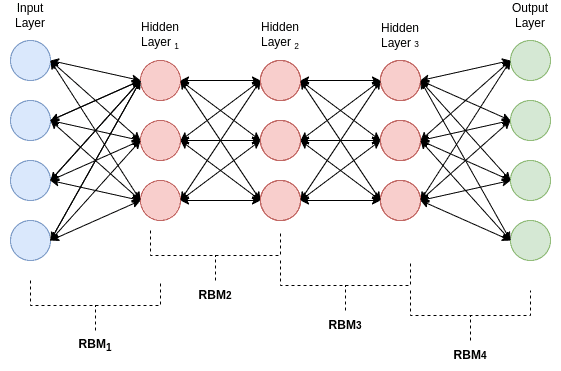

# Deep Generative Models

### Q1. Explain Deep generative model with example. [6]

### **Deep Generative Model**

* **Definition:**
  A deep generative model is a type of deep learning model that learns to generate new data samples similar to the training data.

* **How it Works:**
  It captures the probability distribution of the training data and can generate completely new but realistic-looking examples from it.

* **Example:**
    * **Generative Adversarial Networks (GANs)** — they have two parts: a Generator creates fake images, and a Discriminator tries to distinguish fake from real images. Both improve by competing against each other, leading to realistic image generation.
    * Diagram DK

    *  If you train a generative model on thousands of cat images, it learns the features and patterns of cats and can generate a new cat image that looks real but doesn't exist.

* **Applications:**
  These models are widely used in **Computer Vision**, **Natural Language Processing**, and **Audio Generation** for creating images, synthesizing text, or producing music/speech.

---

### **Types of Deep Generative Models**

* **1. Variational Autoencoders (VAEs):**
  These models compress data into smaller fomat (encoding) & then rebuild or generate new data (decoding

* **2. Generative Adversarial Networks (GANs):**
  Use two networks (generator and discriminator) in competition to produce highly realistic samples like images.

* **3. Autoregressive Models:**
  These models generate data one step at a time ( predicting next valice fiom previous ones).

* **4. Flow-based Models:**
  Transform data through a series of invertible transformations to generate new data.

---

### Q2. Write Short Note on Deep generative model and Deep Belief Networks.[6]
(Explain Deep Belief Network with diagram. [6])

* A Deep Belief Network (DBN) is a type of deep neural network made up of multiple layers 
* These layers are typically composed of Restricted Boltzmann Machines (RBMs), where each layer learns to represent features of the input layer.

### 🔹 **Characteristics of DBN**

* DBNs are **unsupervised during pre-training** (feature learning) and **supervised during fine-tuning** (label-based learning).
* Each RBM in the stack **learns patterns** and passes them to the next layer.
* DBNs are mainly used for:

  * **Dimensionality Reduction**
  * **Feature Extraction**
  * **Image Recognition**

### 🔹 **Working of DBN**

#### i) **Pre-training (Unsupervised Learning)**

* Each RBM is trained one by one.
* The **first RBM** is trained using **raw input data**.
* The **output of each RBM becomes the input** for the next.
* This helps the DBN **learn feature hierarchies layer-by-layer**.

#### ii) **Fine-tuning (Supervised Learning)**

* After stacking all RBMs, the network is **fine-tuned** using **backpropagation** and **labeled data**.
* This step adjusts the weights to **improve accuracy** on prediction tasks.

---

### 🔹 **Applications of DBN**

* **Image classification**
* **Speech recognition**
* **Feature extraction**
* **Dimensionality reduction**

---

### Q3. Explain GAN (Generative Adversarial Network) architecture with an example. [6]

### **What is GAN (Generative Adversarial Network)?**

* A **GAN** is a deep learning model where **two neural networks** compete with each other to generate realistic data.
* It’s called “adversarial” because the two networks — **Generator** and **Discriminator** — are in a constant battle.
* The **goal** is for the generator to create data that is indistinguishable from real data, while the discriminator tries to tell the difference.

---

### **Architecture of GAN**

#### 1. **Generator (G):**

* Takes random noise as input and generates fake data (e.g., fake images).
* Tries to fool the discriminator by producing realistic-looking data.

#### 2. **Discriminator (D):**

* Takes both real and fake data as input and tries to classify them correctly (real vs fake).
* Helps improve the generator by giving feedback.

#### **Training Process:**

* Generator creates fake data.
* Discriminator evaluates both real and fake data.
* Generator improves to fool discriminator better.
* Discriminator improves to detect fakes better.

Thanks for sharing the image! Here's the explanation of the **GAN Architecture** based on the diagram:

---

### **GAN Architecture (with Explanation of the Diagram)**

1. **Random Seed → Generator**

   * A random noise vector (called a seed) is fed into the **Generator**.
   * The generator produces a **fake image** based on this noise.

2. **Real Images + Fake Images → Discriminator**

   * **Real images** from the training dataset and **fake images** from the generator are both passed to the **Discriminator**.
   * The discriminator's job is to classify each image as **real or fake**.

3. **Discriminator Output → Real/Fake Decision**

   * The discriminator outputs a probability (or binary decision) indicating whether an input image is real or fake.

4. **Feedback Loop / Update**

   * The **discriminator gets updated** based on how accurately it distinguishes real from fake.
   * The **generator gets updated** based on how well it fools the discriminator.

### **Example:**

* Suppose you have a dataset of handwritten digits (like MNIST).
* The **Generator** learns to produce fake digit images from random noise.
* The **Discriminator** learns to distinguish between real digit images and the generator’s output.
* Over time, the generator becomes so good that its images are almost indistinguishable from real digits.

---

### Q4. List the applications of GAN network with description. [6]

### 🔹 1. **Image Generation**

**Description:** GANs are widely used to generate new, realistic images from random noise.
**Use Case:** Creating human faces, animals, or even artwork that look real but don't exist in reality.
**Example:** [This Person Does Not Exist](https://thispersondoesnotexist.com) — generates photorealistic faces.

---

### 🔹 2. **Image-to-Image Translation**

**Description:** GANs can convert images from one domain to another while retaining the structure.
**Use Case:** Converting black & white images to color, day to night scenes, or sketches to photos.
**Example:** *Pix2Pix*, *CycleGAN*.

---

### 🔹 3. **Data Augmentation**

**Description:** GANs can create synthetic training data to increase dataset size, helping improve model performance.
**Use Case:** Useful in medical imaging, where collecting large datasets is hard.
**Example:** Generating MRI images for training deep learning models.

---

### 🔹 4. **Super-Resolution**

**Description:** GANs are used to enhance image resolution by learning how to add realistic details to low-resolution images.
**Use Case:** Improving clarity of satellite images, medical scans, and compressed photos.
**Example:** *SRGAN* (Super-Resolution GAN).

---

### 🔹 5. **Text-to-Image Synthesis**

**Description:** GANs can generate images based on descriptive text input.
**Use Case:** Generating product mockups, characters, or scenes based on written prompts.
**Example:** *AttnGAN* or *DALL·E*.

---

### 🔹 6. **Video Generation**

**Description:** GANs are applied to generate short video clips from static images or sequences of frames.
**Use Case:** Animation, video prediction, or synthetic video generation.
**Example:** *MoCoGAN* – Motion and Content Decomposed GAN.

---

### 🔹 7. **Face Aging / Editing**

**Description:** GANs can modify facial features such as aging, smiling, or adding glasses while preserving identity.
**Use Case:** Age progression in photos, virtual try-ons.
**Example:** *FaceApp*, *StyleGAN*.

---

### 🔹 8. **Art and Design**

**Description:** GANs are used to create new artworks, styles, and designs by learning from existing data. Game developers can use GANs to generate unique assets.
**Use Case:** Assisting artists and designers to generate creative content.
**Example:** *AI-generated paintings* using ArtGAN.

### 🔹 9. **Medical Imaging**
**Description:** GANs can generate synthetic medical images for training, augmenting limited datasets.
**Use Case:** Medical imaging analysis, surgical planning, and drug discovery.
**Example:** *GAN-based medical image synthesis*.

### 🔹10 **Deepfake videos**
**Description:** GANs are used to create deepfake videos by manipulating facial expressions and movements.
**Use Case:** Creating realistic fake videos for entertainment, spoofing, or security purposes.
**Example:** *Deepfake videos* created using GANs.

---

### Q5. State and explain different types of GAN. [6]

### 🔹 1. **Vanilla GAN**

**Description:**
The original GAN architecture proposed by Goodfellow. It consists of a simple generator and discriminator trained in a minimax game.
**Use:** Genrating handwritten digits, faces, and other images.

---

### 🔹 2. **Conditional GAN (cGAN)**

- In cGAN, the generation process is conditioned on additional input, such as a class label or another image.

- Both the generator and discriminator receive this extra information to produce more controlled and relevant outputs.

- Example: If the label "cat" is given as input, the generator will produce only cat images.

### 🔹 3. **Deep Convolutional GAN (DCGAN)**

* A more powerful GAN architecture that uses Convolutional Neural Networks (CNNs) instead of fully connected layers.

* DCGAN is known for generating high-quality and realistic images.

* Example: Used to generate fake celebrity faces that appear extremely realistic

### 🔹 4. **Super-Resolution GAN (SRGAN)**
* SRGAN focuses on improving the resolution and quality of images.
* It converts low-resolution (blurry) images into high-resolution (sharp) ones.
* This is especially useful in medical imaging, satellite photos, and enhancing old or compressed images.

### 🔹 5. **CycleGAN**
* CycleGAN is used for image-to-image translation without paired examples.

* It works by learning mappings between two domains using the concept of cycle consistency.

* Example: Transforming photos into paintings without having paired photo-painting datasets. day to night, etc.

---

### 🔹 6. **StyleGAN**

**Description:**
Improves image quality and control by using style-based architecture. Allows control over attributes like age, expression.
**Use:** Generating realistic faces, animals, and other objects.

---

### 🔹 7. **InfoGAN**

**Description:**
Maximizes mutual information to learn interpretable representations within the GAN framework.
**Use:** Generates images with controllable features like rotation, thickness, etc.

---

---
### Q6. How does GAN training scale with batch size? [6]

**Definition:**
- In GANs, *batch size* refers to the number of training samples processed together through the Generator and Discriminator in a single forward-backward pass.
- It plays a crucial role in determining the **learning stability**, **training dynamics**, and **quality of outputs**.

---

### 🔹 Why Batch Size Matters in GANs:

* **Dual Training Nature:** GANs involve two networks competing—if either (Generator or Discriminator) learns too fast or too slow, training can become unstable.
* **Sensitivity:** GANs are more sensitive to batch size compared to regular neural networks due to this adversarial setup.
* **Direct Impact:** The batch size directly influences convergence rate, gradient smoothness, and output quality.

---

### 🔸 Effect of Different Batch Sizes:

#### 1. **Small Batch Size:**

* Leads to **frequent updates**, helping both networks adjust quickly.
* Encourages **faster feedback loops** but can result in **noisy gradients**.
* May cause **slower convergence** and **lower image quality**.

#### 2. **Large Batch Size:**

* Provides **smoother, more stable gradients**.
* Tends to produce **higher-quality images**.
* If too large, it can cause the **Discriminator to overpower the Generator**, leading to **training collapse** or **overfitting**.

---

### 🔹 Best Practices:

* **Moderate batch sizes** like **32**, **64**, or **128** are commonly used and work well in practice.
* **Tuning batch size** is crucial for maintaining a balanced adversarial dynamic and preventing problems like **mode collapse**.
* Increasing batch size may require adjusting:
Learning rate
,Regularization
,Training iterations

---

### Q7. Define Boltzmann machine? Draw and explain architecture of Boltzmann machine. [6]

## 🔹 **Boltzmann Machine (BM)** – Explained Clearly

- A **Boltzmann Machine** (BM) is a type of **stochastic (randomized) recurrent neural network**.
- It is primarily used for **unsupervised learning**, meaning it can learn patterns and features from input data **without needing labeled outputs**.

---

### ✅ **Key Characteristics:**

* Unlike feedforward neural networks, **all neurons in a BM are connected to each other**, allowing the network to **dynamically update its state** and find optimal patterns.
* The BM updates its state using **probability** to gradually settle into a **stable configuration**, known as **energy minimization**.

---

### 🔹 **Structure of Boltzmann Machine:**

It consists of two types of neurons:

1. **Visible Units (Input Layer):**
   Represent the actual input data.
2. **Hidden Units (Hidden Layer):**
   Learn internal representations and hidden features.

* All units are **fully connected**, meaning **each node connects to every other node**, but:

  * **No unit connects to itself**.
  * The network is **symmetric**:
    Weight from unit A to B = weight from B to A.
  * **Connections are bidirectional**, allowing the network to reach a **stable (low-energy)** state.

---

### 🔹 **Energy Function:**

BM uses a special function called an **energy function** to measure how "good" a particular state or pattern is.

* **Lower energy = Better representation**
* The model tries to **minimize this energy** to find the **most probable configuration**.

---

### ✅ **Objectives of Boltzmann Machine:**

1. Model the **probability distribution** of input data.
2. Discover **hidden features or structures** without supervision.
3. **Minimize network energy** to find optimal patterns.
4. Capture **dependencies** between input features.

---

## 🔸 **Types of Boltzmann Machines:**

### 1. **Standard Boltzmann Machine (BM):**

* This is the **original version**.
* **All neurons are connected to each other**:

  * Every visible unit connects with other visible units.
  * Every hidden unit connects with other hidden units.
* It is **very powerful in theory**, as it can model complex data relationships.
* But it's **computationally expensive and slow** to train.

---

### 2. **Restricted Boltzmann Machine (RBM):**

* A **simplified version** of the standard BM.
* **Restriction**: No connections within the same layer.

  * **Visible units connect only to hidden units**, and **vice versa**.
* This reduces the model's complexity and **makes training faster and easier**.
* Widely used in deep learning as a **building block** for other models.

---

### 3. **Deep Belief Network (DBN):**

* Formed by **stacking multiple RBMs**.
* The **output of one RBM becomes the input of the next**.
* This architecture allows the model to learn **multiple levels of features**:

  * From **low-level patterns** (like edges in an image) to **high-level concepts** (like faces).
* Used in tasks like **feature extraction**, **dimensionality reduction**, and **image recognition**.

---

### Q8. Differentiate generative and discriminative models in GAN (Generative Adversarial Network). [6]

| **Aspect**             | **Generator (Generative Model)**                | **Discriminator (Discriminative Model)**        |
| ---------------------- | ----------------------------------------------- | ----------------------------------------------- |
| **Role**               | Generates fake data similar to real data        | Classifies data as real or fake                 |
| **Input**              | Random noise (latent vector)                    | Real or fake data samples                       |
| **Output**             | Fake data sample (e.g., image, text)            | Probability score (real or fake)                |
| **Model Type**         | Generative                                      | Discriminative                                  |
| **Goal**               | Fool the discriminator with realistic fake data | Accurately detect fake data                     |
| **Learning Objective** | Learn the real data distribution                | Learn to distinguish real vs. generated data    |
| **If Trained Well**    | Produces highly realistic synthetic data        | Becomes a strong classifier to detect fake data |
| **Training Process** | Trained jointly with the discriminator         | Trained separately from the generator          |
| **Examples**           | GANs (e.g., StyleGAN), VAE, PixelCNN, PixelRNN | SVM, Logistic Regression, Decision Trees, Random Forests |

---

### Q9. Do GANs (Generative Adversarial Network) find real or fake images? If yes explain it in detail. [6] 
### Explain Discriminator network. [6]

### **Do GANs Find Real or Fake Images?**

**Answer:**
Yes, in GANs (Generative Adversarial Networks), the **Discriminator** is specifically designed to find (identify) whether an image is **real or fake**.

---

### **Explanation:**

A GAN consists of two neural networks:

1. **Generator**
2. **Discriminator**

#### **1. Generator:**

* It creates **fake images** by taking random noise as input.
* Its goal is to generate images that are so realistic that the discriminator cannot tell they are fake.

#### **2. Discriminator:**

* It takes both **real images** (from training data) and **fake images** (from the generator).
* It outputs a **probability** indicating whether the input image is **real (close to 1)** or **fake (close to 0)**.
* Its goal is to **correctly detect fake images**.

---

### **How It Works:**

* The **Discriminator learns to find real or fake images** by comparing them during training.
* The **Generator tries to fool** the discriminator by making better and more realistic fake images.
* Over time, both networks improve through **adversarial training**:

  * The discriminator becomes better at detecting fakes.
  * The generator becomes better at creating realistic images.

---

### **Conclusion:**

Yes, GANs **do find real or fake images** through the discriminator. This adversarial process improves the generator’s ability to create realistic images and the discriminator’s ability to detect fake ones.
