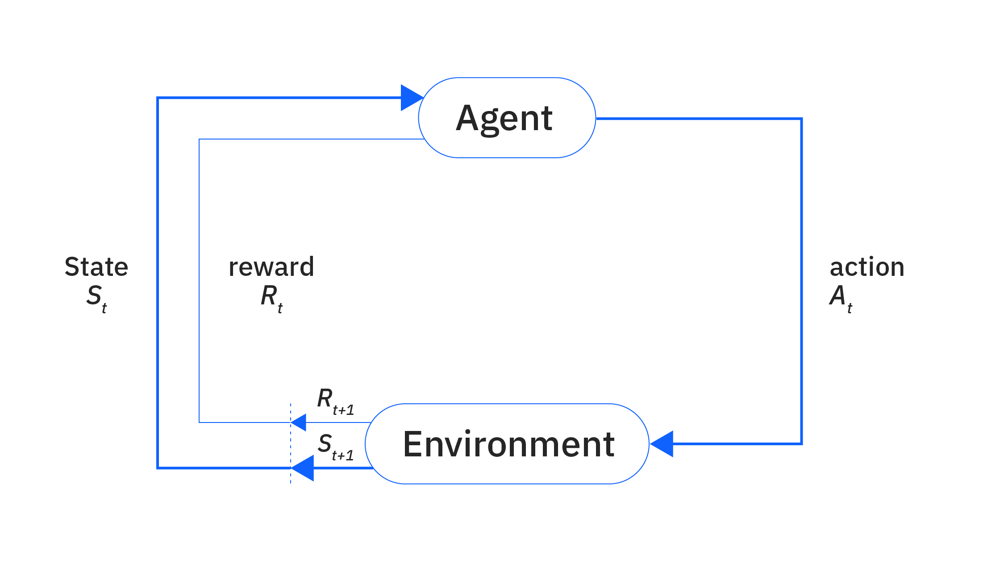
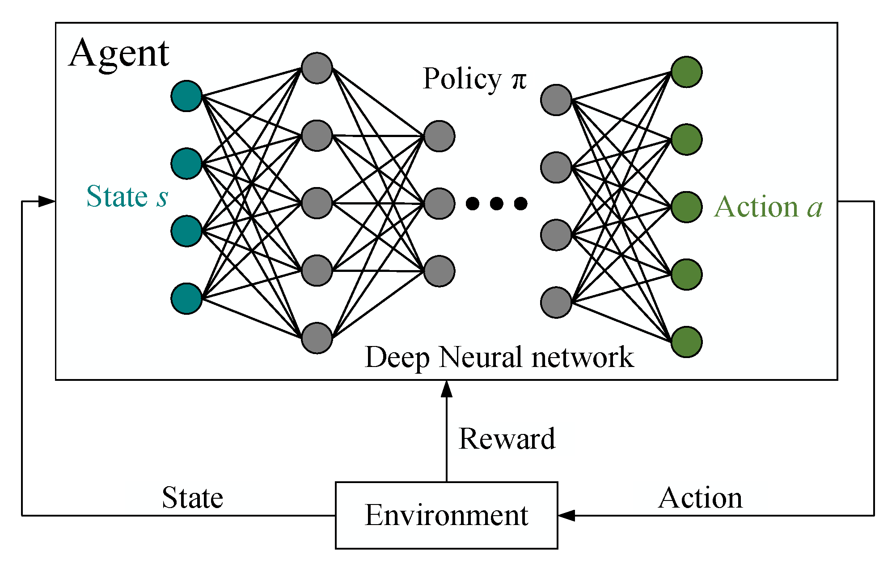

# Reinforcement Learning

### Q1. What is Reinforcement Learning? State and explain its advantages and disadvantages. [6]

### **Reinforcement Learning – 5 Points**

1. **Definition:**
   Reinforcement Learning (RL) is a type of machine learning where an agent learns to make decisions by interacting with an environment.

2. **Trial-and-Error Learning:**
   The agent performs actions and learns from the **rewards** (positive feedback) or **penalties** (negative feedback) it receives.

3. **Goal:**
   The main objective is to **maximize cumulative rewards** over time through optimal action selection.

4. **Environment Interaction:**
   RL involves a continuous **loop**: the agent observes the state, takes an action, receives a reward, and updates its policy.

5. **Applications:**
   Widely used in **robotics**, **game AI (e.g., AlphaGo)**, **autonomous vehicles**, and 
   **recommendation systems**.

### **Advantages of Reinforcement Learning:**

1. **Learns from interaction:**

   * RL allows agents to learn optimal behavior directly from the environment without requiring labeled data.

2. **Adaptability:**

   * It can adapt to **dynamic environments**, making it useful in real-time decision-making tasks like robotics and gaming.

3. **Long-term reward optimization:**

   * RL focuses on maximizing **future rewards**, which makes it effective in planning and control tasks.

4. **Solves Sequential Decision-Making:**
   * RL is well-suited for tasks where decisions need to be made in a sequence, such as **game playing** or **robot navigation**.
---

### **Disadvantages of Reinforcement Learning:**

1. **High computational cost:**

   * Training RL models requires a large number of interactions with the environment, which is **computationally expensive**.

2. **Exploration-exploitation trade-off:**

   * Balancing **exploring new actions** vs. **exploiting known actions** is challenging and can slow down learning.

3. **Difficult to design reward functions:**

   * A poorly designed reward function can lead to **undesired behavior** or poor performance.

4. **Takes time to learn:**
   * RL models can take a long time to learn optimal policies, especially in complex environments.
---

### Q2. What are different characteristics of Reinforcement Learning? [6]

1. **Trial-and-Error Learning:**
    RL involves **trial-and-error learning**, where the agent learns from its experiences by interacting with the environment.

2. **Exploration vs. Exploitation:**
    * The agent must **balance** between **exploring** new actions and **exploiting** known actions to maximize rewards.
    * Exploring means trying out new actions to discover potentially better ones, while exploitation means sticking to known actions that have been proven effective.

3. **Delayed Rewards:**
    * Rewards are often **delayed**, meaning that the agent may not receive immediate feedback for its actions. This makes it challenging to learn from immediate feedback. It must learn to such actions with long-term rewards.

4. **Sequential Decision Making:**
    * RL is often used for tasks where decisions must be made in a **sequence**, such as in game playing or robotics.

5. **No Supervised Output:**
   * Unlike supervised learning, RL does not have a **supervised output**. The agent learns from the environment's feedback, which may not be labeled or structured.

6. **Learning from the Environment:**
   * The agent learns from the environment's **rewards** and **penalties**, which are often **delayed** and **sparse**. It gets feedback only after taking an action.

7. **Environment Dependency:**
   * The agent's performance depends on the **environment** it is interacting with. The same algorithm may behave differently in different environment

8. **Policy-based Learning:**
    * RL is often **policy-based**, meaning that the agent learns based on policy which defines how agent chooses actions in different states

---

### Q3. What are different types of Reinforcement Learning? Explain in brief.[6]

Here’s your **refined and exam-ready answer** for:

---

### **Types of Reinforcement Learning \[6 Marks]**

---

#### **1) Positive Reinforcement Learning**

* The agent receives a **reward** for performing a **correct action**.
* Encourages the agent to **repeat** that action to gain more rewards.
* **Example:** In a game, awarding points for a correct move.

---

#### **2) Negative Reinforcement Learning**

* Involves **removing an unpleasant condition** when the agent performs the right action.
* Helps the agent avoid bad situations and **move toward better states**.
* **Example:** A robot touches a hot surface → it feels pain (negative feedback) → it avoids touching it again in the future.

---

#### **3) Model-Based Reinforcement Learning**

* The agent **builds a model** of the environment to predict future states and rewards.
* It can simulate actions before execution.
* **Example:** A robot simulating moves before trying them physically.

---

#### **4) Model-Free Reinforcement Learning**

* The agent does **not build a model** of the environment.
* It learns **directly from experience** — actions and their outcomes.
* **Example:** A robot learns by trial and error without a map.

---

#### **5) Online Reinforcement Learning**

* The agent **learns in real-time** while interacting with the environment.
* Updates its strategy **continuously** based on new data.
* **Example:** Chatbots improving responses through user interaction.

---

#### **6) Offline (Batch) Reinforcement Learning**

* The agent learns from a **fixed dataset** of past experiences.
* **No interaction** with the environment during training.
* **Example:** Learning from historical driving data.

---

### Q4. What are the challenges of reinforcement learning? Explain any four in detail. [6]

Here’s an **exam-ready answer** for:

---

### **What are the challenges of Reinforcement Learning? \[6 Marks]**

---

### **Challenges of Reinforcement Learning:**

1. **Exploration vs. Exploitation Trade-off:**

   * Balancing between **exploring new actions** and **exploiting known good actions** is difficult and affects learning efficiency.
   * Exploration means taying out new actions to discover better rewards
   * Exploitation means using known actions that give high rewards.
   * If the agent explores too much, it may waste time on poor actionS
   * If the agent exploits too early, it may miss better actions.
   * The agent must learn to balance exploration and exploitation.

2. **Delayed Rewards:**

* In Reinforcement Learning, **rewards are often not immediate** after taking an action.
* The agent must perform **several steps** before receiving feedback.
* This makes it difficult to **identify which specific action** led to the final reward or penalty.
* **Example:** In a chess game, the outcome (win/loss) is known **only at the end**, not after every move, making learning **slow and complex**.

3. **High Computational Cost:**
   * Solving complex problems with RL can be computationally **expensive**.
   * Training an RL model can require **large datasets** and **high computational resources**.
   * This can be a challenge for **real-world applications** where resources are limited.
   * **Example:** Training a self-driving car to navigate complex city streets requires significant computational power.

4. **Environment Non-Stationarity:**
   * The environment in which the agent operates may change over time.
   * This makes it difficult for the agent to learn an optimal policy.
   * **Example:** A self-driving car's environment changes with traffic conditions.
    

5. **Designing Reward Functions:**

   * Poorly designed rewards may lead to **undesired behavior** or make learning unstable.

6. **Scalability:**

   * RL models may **not scale well** to complex or real-world environments with many states and actions.

---

### Q5. What is deep reinforcement learning? Explain in detail. [6]

### **Definition:**

* **Deep Reinforcement Learning (Deep RL)** combines the strengths of **Reinforcement Learning (RL)** and **Deep Learning (DL)**.
* It enables agents to learn optimal actions using **deep neural networks** instead of simple tables or formulas.
* Used in robotics, self-driving cars, game playing (e.g., AlphaGo, Atari games), recommendation systems, and more.
* While Deep RL is powerful, it often requires **large amounts of data** and **high computational resources** to train effectively.

---

### **Key Features:**

1. The agent uses a **deep neural network** to approximate the value of actions or strategies.
2. It can handle **complex environments** with high-dimensional inputs like images, video, or sensor data.
3. Learning happens through **trial and error**, receiving rewards or penalties after actions.

---

### **Working:**

* The agent **observes the environment** (e.g., image or sensor data).
* The **deep neural network** processes this input and suggests the best action.
* The agent **performs the action**, receives a **reward**, and the neural network updates its weights.
* Over time, the agent improves its behavior through repeated interaction and learning.

---

### **Example:**

* **Self-Driving Cars** use Deep RL to learn road navigation by interacting with simulated or real-world environments.

---

### Q6. Explain Markov Decision Process with Markov property. [6]

* A Markov Decision Process is a mathematical framework used to describe the environment in Reinforcement Learning (RL).
* It helps model decision-making where outcomes are partly random and partly under the control of an agent.
* It helps define how an agent should act in each situation to **maximize long-term rewards**.
* MDP assumes that the **future depends only on the current state**, not on past states.

---

### **Components of MDP:**

1. **State (S):**

   * All possible situations an agent can be in.
   * Example: In a grid game, each cell is a state.

2. **Actions (A):**

   * Choices the agent can make from each state.
   * Example: Move left, right, up, or down.

3. **Transition Probability (P):**

   * Probability of moving from one state to another after an action.

4. **Reward (R):**

   * Feedback received after taking an action in a state.
   * The agent’s goal is to maximize the total reward over time.

5. **Policy (π):**

   * Strategy the agent uses to choose actions.

---

### **Markov Property:**

* The next state depends **only on the current state and action**, not on the history of past states or actions.
* Example: A robot’s decision depends only on its **current location**, not where it was previously.

---

### **Example:**

* A robot moves in a room.
* **State:** Current location of the robot.
* **Actions:** Move forward, turn left, turn right.
* **Transition:** Moving forward leads to a new spot with some probability.
* **Reward:** Reaching charging station gives +10 reward.
* The robot needs only current position to decide next move (Markov Property).

---

### Q7. Explain in detail Dynamic programming algorithms for reinforcement learning. [6]

- Dynamic Programming (DP) algorithms are used in Reinforcement Learning to compute optimal policies and value functions when the model of the environment (MDP) is known.that is, when we know the states, actions, rewards, and transition probabilities.
- DP breaks down problems into smaller subproblems , solves them recursively and combines their solutions to solve the original problem.

### Algorithms

* **Policy Evaluation:** Calculate the value function for a given policy.
* **Policy Improvement:** Improve the policy using the value function.
* **Policy Iteration:** Alternate between evaluation and improvement to find the optimal policy.
* **Value Iteration:** Combine evaluation and improvement in a single step to directly find the optimal value function.

### **Main Algorithms:**

**a) Policy Evaluation:**

* Given a policy π, compute the state-value function Vπ(s) by solving Bellman expectation equations iteratively until convergence.

**b) Policy Improvement:**

* Improve the current policy by choosing actions that maximize expected rewards based on Vπ(s).

**c) Policy Iteration:**

* Combines Policy Evaluation and Policy Improvement in a loop:
    * a) Evaluate the current policy.
    * b) Improve the policy using updated values.
    * c) Repeat until the policy stops changing (converges).

**d) Value Iteration:**

* Update value function V(s) using Bellman optimality equation iteratively until convergence.
* After convergence, extract the optimal policy by choosing actions that maximize the right-hand side.

---

### Q8. Write Short Note on Q Learning and Deep Q-Networks. [6]

### **1. Q-Learning:**

* **Definition:**
  Q-learning is a **model-free** reinforcement learning algorithm used to find the **optimal policy** by learning the value of state-action pairs, called **Q-values**.

* **Q-Value:**
  $Q(s, a)$ represents the expected future reward of taking action **a** in state **s** and following the optimal policy afterward.

* **Q-Update Rule:**

  $$
  Q(s, a) \leftarrow Q(s, a) + \alpha \left[ r + \gamma \max_{a'} Q(s', a') - Q(s, a) \right]
  $$

  * $\alpha$: Learning rate
  * $\gamma$: Discount factor
  * $r$: Reward
  * $s'$: Next state
  * $a'$: Next action

* **Goal:**
  Learn the best action in each state by updating Q-values over time.

### **Features of Q-Learning:**

1. **Table-Based Method**

   * Q-learning uses a **Q-table** to store values for each state-action pair $Q(s, a)$.
   * It works well for small environments with discrete states and actions.

2. **Model-Free Learning**

   * It does **not require a model** of the environment.
   * The agent learns directly from **interactions** with the environment.

3. **Learning from Experience**

   * The agent explores the environment and **updates Q-values** using the **Q-learning update rule**.
   * This is done through trial-and-error.

### **2. Deep Q-Network (DQN):**

* **Problem with Q-learning:**
  Q- learning doesn't work well for large or continuous state Spaces because it tries to store all Q-values in a table

* **Solution – DQN:**
  * DQN replaces the Q-table with a **deep neural network** to approximate Q-values.
  * It uses a neural network instead of Q-table to approximate Q- values, allowing it to handle large/ continuaus state spaces

* **Working:**

  * Input: state
  * Output: Q-values for all possible actions
  * Action with the highest Q-value is selected.

* **Key Features of DQN:**

1. **Neural Network Approximation** – Uses a neural network instead of a Q-table.
2. **Experience Replay** – Stores and reuses past experiences to improve learning.
3. **Target Network** – Uses a separate target network for stable updates.
4. **Handles Complex States** – Works well with large or continuous state spaces.

* **Applications:**
  Used in games (e.g., Atari), robotics, self-driving cars, etc.

---

### Q9.  Explain Simple reinforcement learning for Tic-Tac-Toe. [5]

**Simple Reinforcement Learning for Tic-Tac-Toe:**

1. **Environment**:

   * The Tic-Tac-Toe board is the environment with 3×3 grid states.

2. **Agent**:

   * The player (AI) is the agent learning to play.

3. **States**:

   * Each unique board configuration is a state.

4. **Actions**:

   * Placing X or O in an empty cell is the action.

5. **Policy**:

   * Initially, moves are random. Over time, the agent learns better moves.

6. **Rewards**:

   * Win = +1, Draw = 0, Loss = -1.

7. **Learning Process**:

   * Agent plays many games.
   * After each game, updates state-action values using rewards.
   * Uses greedy strategy to pick moves with higher expected rewards.

8. **Goal**:

   * Learn the best policy to maximize chances of winning.

---

### Q10. Compare Active and Passive Reinforcement Learning. [5]

Here is the **8-point difference** between Active and Passive Reinforcement Learning in a table format:

| **Aspect**              | **Active Reinforcement Learning**                       | **Passive Reinforcement Learning**                        |
| ----------------------- | ------------------------------------------------------- | --------------------------------------------------------- |
| 1. **Action Selection** | Agent **actively chooses** which actions to take        | Agent **follows a fixed policy**, does not choose actions |
| 2. **Policy Learning**  | Learns the **optimal policy**                           | Learns the **value of a fixed policy**                    |
| 3. **Value Learning**   | Learns **both policy and value function**               | Learns **only the value function**                        |
| 4. **Control**          | Agent has **full control** over its actions             | Agent has **no control**, just observes                   |
| 5. **Goal**             | To **find the best strategy** via trial and error       | To **evaluate how good a fixed strategy** is              |
| 6. **Exploration**      | Requires **exploration** of environment                 | No exploration; follows **given actions**                 |
| 7. **Usage Scenario**   | Used when the agent **needs to learn** optimal behavior | Used when the agent already has a policy to **evaluate**  |
| 8. **Example**          | Robot deciding best path in a maze                      | Robot following a predefined path and assessing it        |

---

Let me know if you want it more concise or detailed!
