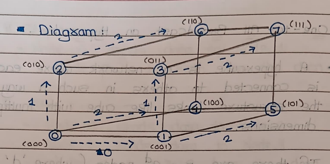
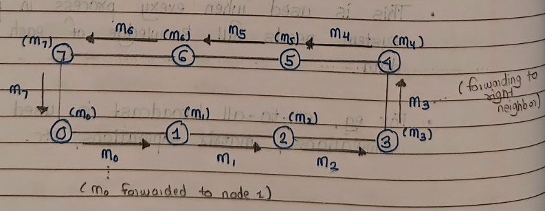

# Parallel Communication

### Q1. Explain with diagram One-to-all broadcast on an eight-node ring with recursive doubling technique. Node 0 is the source of the broadcast

- In **High Performance Computing**, **One-to-All Broadcast** is a communication pattern where a message from one source node is distributed to all other nodes in the system.
-  In this, one node (source node) has some data and it needs to send (broadcast) this data to all other nodes in the netwark.
- The goal is to quickly & efficiently share the data with all nodes.


#### 🔁 **Recursive Doubling Technique:**

This is an efficient method that works in `log₂(P)` steps, where `P` is the number of nodes. In each step, nodes that already have the message forward it to other nodes at an exponentially increasing distance.

#### Eight-Node Ring Operation:

* Number of nodes = 8
* Nodes are arranged in a ring topology
* Node 0 is the source

#### 🧠 **Working Steps:**

Let the nodes be numbered from 0 to 7.

1. **Step 1 (Distance = 1):**

   * Node 0 sends the message to Node 1.

2. **Step 2 (Distance = 2):**

   * Node 0 sends to Node 2
   * Node 1 sends to Node 3

3. **Step 3 (Distance = 4):**

   * Node 0 sends to Node 4
   * Node 1 sends to Node 5
   * Node 2 sends to Node 6
   * Node 3 sends to Node 7

#### 🖼️ **Diagram:**

```
Initial:
[0*] 1  2  3  4  5  6  7

Step 1:
0 → 1
[0*] [1*] 2  3  4  5  6  7

Step 2:
0 → 2, 1 → 3
[0*] [1*] [2*] [3*] 4  5  6  7

Step 3:
0 → 4, 1 → 5, 2 → 6, 3 → 7
[0*] [1*] [2*] [3*] [4*] [5*] [6*] [7*]
```

#### ✅ **Advantages:**

* Fast: Completes in `log₂(n)` steps
* Scalable and parallel
* Efficient for large-scale systems

---

### Q2. What is one-to-all broadcast? Explain it with the help of algorithm for one-to-all broadcast on hypercube. Comment on cost calculation. [7]

#### **📘 One-to-All Broadcast:**

One-to-All Broadcast is a collective communication operation in parallel and distributed computing, where **a single source node sends the same message to all other nodes** in the system.

---

### **🔺 Hypercube Topology:**

-  A hypercube is a network where each node is connected to others in such a way that the structure looks like cube with multiple dimensions

A **Hypercube** is a multi-dimensional network topology where:

* Each node is labeled with a binary number of `d` bits.
* There are `p = 2^d` nodes.
* Each node is connected to `d` other nodes, where connections differ by exactly one bit in the binary address.

---

### **📡 One-to-All Broadcast Algorithm (on Hypercube):**

**Goal:** Disseminate a message from **source node (Node 0)** to all other nodes.

#### **Algorithm Steps:**

1. **Initialization:**

   * Only **Node 0** (the source) has the message.

2. **For i = 0 to d - 1:**

   * Each node that **already has** the message sends it to a neighbor node.
   * The neighbor differs from the sender by **only the i-th bit** in its binary node address.

3. After **d steps**, all `2^d` nodes will have received the message.

---

### **🔢 Example: One-to-All Broadcast on a 3D Hypercube (8 Nodes)**

Each node is labeled from `000` to `111`.

#### **Step 0 (i = 0):**

* `Node 000 → Node 001`

#### **Step 1 (i = 1):**

* `Node 000 → Node 010`
* `Node 001 → Node 011`

#### **Step 2 (i = 2):**

* `Node 000 → Node 100`
* `Node 001 → Node 101`
* `Node 010 → Node 110`
* `Node 011 → Node 111`

✅ After 3 steps (`d = 3`), all 8 nodes have the message.



### **📊 Cost Analysis:**

#### ⏱️ **Time Cost (T):**

* At each step, nodes operate **in parallel**.
* Total number of steps = `log₂(p)` = `d`
* **Time Complexity: `O(log p)`**

#### 📦 **Message Cost (M):**

* In each step, each sender sends **one message**.
* Total number of messages sent = `p - 1` (only one node has message at start).
* **Message Complexity: `p - 1`**


### **Q3. Explain One-to-All Broadcast on a 16-Node Mesh**

### **🧠 What is a Mesh Topology?**

* A **mesh network** is a 2D grid of nodes.
* In a **4×4 mesh**, there are **16 nodes** arranged in 4 rows and 4 columns.
* Each node is connected to its adjacent nodes (left, right, top, bottom), except at boundaries.

Example of 16-node mesh (Node numbers shown row-wise):

```
0   1   2   3  
4   5   6   7  
8   9  10  11  
12 13  14  15
```

---

### **📡 One-to-All Broadcast on a Mesh**

**Goal:** Spread a message from a **source node (Node 0)** to all other nodes in the mesh.
The broadcasting usually happens in 2 phase
1. The message is sent horizontally across row
2. The message is sent vertically down each column
---

### **📜 Algorithm (Row-wise then Column-wise):**

#### **Step 1: Row Broadcast**

* The message is first broadcast along **row 0**.
* Node 0 → Node 1 → Node 2 → Node 3

#### **Step 2: Column Broadcast**

* Each node in **row 0** (Nodes 0 to 3) broadcasts the message **down its column**:

  * Node 0 → 4 → 8 → 12
  * Node 1 → 5 → 9 → 13
  * Node 2 → 6 → 10 → 14
  * Node 3 → 7 → 11 → 15

---

### **🪜 Step-by-Step Example:**

1. **Row 0 Broadcast:**

   ```
   0 → 1 → 2 → 3
   ```

2. **Column Broadcasts:**

   * From Node 0: 0 → 4 → 8 → 12
   * From Node 1: 1 → 5 → 9 → 13
   * From Node 2: 2 → 6 → 10 → 14
   * From Node 3: 3 → 7 → 11 → 15

✅ After these steps, all nodes have the message.

<immg src="./assets/Unit3Img/2.png" alt="Mesh Example">

---

### Q4. Explain all to one reduction with node 0 as destination.

* **All-to-One Reduction** is a communication operation where **all nodes** in a parallel system contribute data (e.g., integers), and a **single node (usually Node 0)** computes the **result** using an operation like:

  * **SUM**
  * **MAX/MIN**
  * **AND/OR**, etc.

---

### **📍 Example Scenario:**

* System with **p = 8 nodes** (Node 0 to Node 7)
* Each node holds a **number**.
* Goal: Compute the **sum** of all values at **Node 0**.

---

### **📡 Algorithm (Using Recursive Doubling - Reverse of Broadcast):**

Let `p = 2^d` nodes.

#### **Step-by-Step Process (d = log₂(p)):**

Each step `i` (from 0 to d-1), nodes **pair up** such that:

* If a node’s `i-th bit` is 0, it **receives** data from its partner.
* If the bit is 1, it **sends** data to its partner and **stops participating**.

#### ✅ Example for p = 8 (3D):

##### **Initial Values:**

```
Node 0: a0
Node 1: a1
Node 2: a2
Node 3: a3
Node 4: a4
Node 5: a5
Node 6: a6
Node 7: a7
```

##### **Step 0 (i = 0):**

* Node 1 → Node 0
* Node 3 → Node 2
* Node 5 → Node 4
* Node 7 → Node 6

Each receiver adds value and stores partial sum.

##### **Step 1 (i = 1):**

* Node 2 → Node 0
* Node 6 → Node 4

##### **Step 2 (i = 2):**

* Node 4 → Node 0

Final sum `a0 + a1 + a2 + ... + a7` is now at **Node 0**.

---

### **📊 Cost Analysis:**

Let `p = number of nodes`, `d = log₂(p)`

#### ⏱ Time Complexity:

* **O(log p)** steps (as in each step, half the nodes send)

#### 📦 Message Complexity:

* **p - 1** messages (each node sends once except destination)

---

### Q5. What is all to all broadcast communication operation? Explain all to all broadcast on an eight node ring with step wise diagrams. (Show first two steps and last communication step).

### 🧠 **Definition: All-to-All Broadcast**

* In **All-to-All Broadcast**, every node in the system sends **its data** to **every other node**.
* After the operation, **each node has data from all nodes**.
* This is also called **complete exchange** or **personalized broadcast**.

---

### 🕸️ **Topology: Ring**

* Consider **8 nodes** connected in a ring:
  `0 - 1 - 2 - 3 - 4 - 5 - 6 - 7 - (back to 0)`

---

### 📜 **Algorithm Overview (Step-wise Exchange)**

Each node:

* Sends data to its **right neighbor** in each step.
* For **p = 8** nodes, it takes **(p – 1) = 7 steps**.
* In each step, a node sends the **next data item** it has received (not just its own).

---

### 🔄 **Step-by-Step Communication (First 2 and Last Step)**

Let each node have its own data `D0, D1, ..., D7`.

#### ➤ **Step 0 (Initial):**

Each node has its own data:

```
Node 0: [D0]
Node 1: [D1]
Node 2: [D2]
Node 3: [D3]
Node 4: [D4]
Node 5: [D5]
Node 6: [D6]
Node 7: [D7]
```

---

#### ➤ **Step 1:**

Each node sends **its own data** to right neighbor.

**After Step 1:**

```
Node 0: [D0, D7]
Node 1: [D1, D0]
Node 2: [D2, D1]
Node 3: [D3, D2]
Node 4: [D4, D3]
Node 5: [D5, D4]
Node 6: [D6, D5]
Node 7: [D7, D6]
```
Aftex (N-1). steps; each náde has received messages from-all othex nodes
---

#### ➤ **Step 2:**

Each node sends the **data it received in Step 1** to the next node.

**After Step 2:**

```
Node 0: [D0, D7, D6]
Node 1: [D1, D0, D7]
Node 2: [D2, D1, D0]
Node 3: [D3, D2, D1]
Node 4: [D4, D3, D2]
Node 5: [D5, D4, D3]
Node 6: [D6, D5, D4]
Node 7: [D7, D6, D5]
```

---

#### ➤ **Final Step (Step 7):**

Each node sends the last received item.

**After Step 7:**

Each node now has: `[D0, D1, D2, D3, D4, D5, D6, D7]`
(if possible you can draw circular diagram)

---

### 📊 **Cost Analysis:**

* **Steps:** `p – 1` = 7 steps for `p = 8`
* **Messages per Step:** `p` (one per node)
* **Total Messages:** `p × (p – 1)`

---

### Q6. Explain All-to-All Broadcast on Array, Mesh & Hypercube Topologies.**


### 🔁 **All-to-All Broadcast:**

All-to-All Broadcast is a communication operation in which **every processor sends its own data to all other processors** in the network. After completion, **each processor holds the data of all other processors**.

---

### 1️⃣ **All-to-All Broadcast on Linear Array (1D Array):**

* Processors are connected in a straight line.
* Each processor sends its data to its right neighbor in each step.
* Data propagates one hop at a time.

📌 **Steps Required:** (p − 1) steps
📌 **Time Complexity:** `O(p)`

---

### 2️⃣ **All-to-All Broadcast on 2D Mesh:**

* Processors are arranged in a 2D grid (√p × √p).
* Communication happens in two phases:

  1. **Row-wise Broadcast** (each row shares data within itself)
  2. **Column-wise Broadcast** (each column shares data vertically)

📌 **Steps Required:** 2 × (√p − 1)
📌 **Time Complexity:** `O(√p)`

---

### 3️⃣ **All-to-All Broadcast on Hypercube:**

* A d-dimensional hypercube has p = 2^d nodes.
* Each processor communicates with neighbors that differ in one binary bit.
* In each step, data is exchanged along one dimension.

📌 **Steps Required:** `log₂(p)` steps
📌 **Time Complexity:** `O(log p)`

---


### Q7. Explain all to all broadcast and all to all reduction communication operation with example? Discuss cost analysis. [7]

## 🔁 **1. All-to-All Broadcast**

### 🧠 **Definition:**

In **All-to-All Broadcast**, every node sends its **own data to every other node**.

* After the operation, each node holds **data from all other nodes**.
* Also called **Complete Exchange** or **Personalized Broadcast**.

---

### 🧪 **Example:**

Consider a system with 4 nodes:

* Initial data:
  `Node 0: D0`, `Node 1: D1`, `Node 2: D2`, `Node 3: D3`

* After **All-to-All Broadcast**:

  ```
  Node 0: [D0, D1, D2, D3]  
  Node 1: [D0, D1, D2, D3]  
  Node 2: [D0, D1, D2, D3]  
  Node 3: [D0, D1, D2, D3]
  ```

---

### 💰 **Cost Analysis:**

* **Messages per Node:** Each node sends (p − 1) messages
* **Total Messages:** `p × (p − 1)`
* **Time Complexity:** Depends on network topology

  * Ring: `O(p)`
  * Mesh/Hypercube: `O(log p)`

---

## ➕ **2. All-to-All Reduction**

All-to-All Reduction is a **collective communication operation** where:

* Each node starts with its own data.
* A **reduction operation** (e.g., sum, max, min, etc.) is applied across all nodes.
* **Every node ends up with the final reduced result**, not just one destination node.

---

### 🧩 **Working Principle:**

Let the reduction operation be **sum**.

* The process proceeds in **N−1 steps** for **N nodes**.
* In each step:

  * Every node **sends its current value** to its **right neighbor**.
  * It also **receives a value** from its **left neighbor**, and **adds it** to its total.
* Over `N−1` steps, each node will receive and add values from **all other nodes**, thus computing the total sum.

---

### 🧪 **Example: All-to-All Reduction on 8-Node Ring**

Each node has data as follows:

| Node | Value |
| ---- | ----- |
| 0    | 5     |
| 1    | 3     |
| 2    | 6     |
| 3    | 2     |
| 4    | 4     |
| 5    | 1     |
| 6    | 7     |
| 7    | 8     |

#### **Step 1:**

* Node 0 sends 5 → Node 1
* Node 0 receives 8 ← Node 7
* Node 0 holds: `5 + 8 = 13`

#### **Step 2:**

* Node 0 sends 13 → Node 1
* Receives next value from left → Adds again

✅ This process continues for `N−1 = 7` steps.

#### **Final Result:**

* After 7 steps, **each node holds the total sum: 5+3+6+2+4+1+7+8 = 36**

---

### 📊 **Cost Analysis:**

* **Number of Steps:** N − 1
* **Messages per Step:** N
* **Total Messages:** N × (N − 1)
* **Time Complexity:** `O(N)`

---

### Q8. Explain in detail Blocking and Non-Blocking Communication Using MPI. [6]

### 📌 **Introduction to MPI:**

MPI (**Message Passing Interface**) is a standard used in parallel computing to allow **communication between processes** in distributed systems.

---

## 🔷 **1. Blocking Communication:**

### 📖 **Definition:**

In **Blocking Communication**, the function **does not return control to the program until the communication (send/receive) is complete**.
- In blocking communication, a process waits for the communication to finish before proceeding to the next instruction.
- This means that the process is **blocked** until the communication is complete.
- In blocking communication, the sender and receiver are **synchronized**
-  For eg, if Process A sends data to Process B, Process A will pause until message has been safely delivered & only then continue its next work.

### 💡 **Example Functions:**

* `MPI_Send()` – Blocking send
* `MPI_Recv()` – Blocking receive


### ✅ **Advantages:**

* Simple to use.
* Easier to code
* Synchronization is easier.

### ❌ **Disadvantages:**

* Wastes time if the process has to wait, introducing delays
* Not suitable when overlapping communication and computation is needed.

---

## 🔷 **2. Non-Blocking Communication:**

### 📖 **Definition:**

In **Non-Blocking Communication**, the function **returns immediately**, and the actual communication happens **in the background**.
- In non-blocking communication, a process does not wait for the communication to finish before proceeding to the next instruction.
- This means that the process is **not blocked** until the communication is complete.
- In non-blocking communication, the sender and receiver are **not synchronized**
- For eg, if Process A sends data to Process B, Process A will continue its next work without waiting for message to be delivered.
- You can check later if the message has been delivered by using `MPI_Test()` or `MPI_Wait()`.
-  It is mostly usefal to avexlap communication& computation.

---

### 💡 **Example Functions:**

* `MPI_Isend()` – Non-blocking send
* `MPI_Irecv()` – Non-blocking receive
* `MPI_Wait()` – Ensures completion

---

### ✅ **Advantages:**

* Overlaps communication with computation.
* Better performance in large-scale applications.

### ❌ **Disadvantages:**

* More complex to implement.
* Requires careful synchronization.

### Q9. Write a short note on prefix-sum operation. [4]

### 📌 **Definition:**

The **Prefix-Sum** operation, also known as the **scan** operation, is a fundamental collective operation in parallel computing.
It computes all **partial sums** of a sequence of numbers.
- The prefix- sum is a common parallel operation where each processor / node has an
input value, & goal is to compute sum of all values from first node up to the current one
- This is useful for many parallel algorithms, e.g. for computing cumulative sums, finding the maximum value in an array, etc.

---

### 🧠 **Mathematical Form:**

Given an input array:
`X = [x₀, x₁, x₂, ..., xₙ₋₁]`

The prefix sum array `Y` is:

* `Y[0] = x₀`
* `Y[1] = x₀ + x₁`
* `Y[2] = x₀ + x₁ + x₂`
* ...
* `Y[n−1] = x₀ + x₁ + ... + xₙ₋₁`

---

### 🔄 **Types:**

1. **Inclusive Prefix Sum:**
   Includes the current element in sum:
   `Y[i] = x₀ + x₁ + ... + xᵢ`

2. **Exclusive Prefix Sum:**
   Excludes the current element:
   `Y[i] = x₀ + x₁ + ... + xᵢ₋₁` (Y\[0] = 0)

---

### 🧪 **Example:**

Input: `X = [3, 1, 4, 2]`

* **Inclusive:** `Y = [3, 4, 8, 10]`
* **Exclusive:** `Y = [0, 3, 4, 8]`

### 📦 **Applications:**

* Parallel algorithms
* Sorting (radix sort)
* Histogram computation
* Load balancing
* Graphics (scanlines, transparency)

---

### Q10. Explain scatter and gather communication operation. [6]


## 📤 SCATTER Communication Operation

### ✅ **Definition:**

Scatter is a **one-to-many** collective communication operation in parallel computing where a **root process distributes distinct parts** of a dataset to **multiple processes**.

---

### 📌 **Key Points:**

* Root process holds the full dataset.
* Data is **divided into equal parts** and sent to each process.
* **Each process gets a unique chunk** of the data.
* This improves efficiency by **distributing workload** for parallel processing.

---

### 📦 **Example:**

If you have **1000 records** and **4 processors**:

* Each processor gets **250 records**.
* Instead of all accessing the full data, they process their assigned chunk only.

---

### 🧠 **Usage:**

* Common in **matrix multiplication**, **searching**, **data analysis**, etc.

---

### 🖼️ **Diagram:**

```
     Root Process (P0)
         [M0 M1 M2 M3]
          /  |  |  \
        M0  M1 M2  M3
       P0  P1 P2  P3
```

Where:

* `M0` to `M3` are parts of the dataset.
* `P0` to `P3` are the nodes/processes.


## 📥 GATHER Communication Operation

### ✅ **Definition:**
- Gather operation is the xevexse of scatter
-  a **many-to-one** communication where **each process sends its data** to a **root process**, which collects all pieces into one array or structure.
- It is used when multiple processes have computed individual results, and those results
need to be collected into a single process for further processing, analysis, etc.

---

### 📌 **Key Points:**

* Each process sends its **partial result**.
* Root process **gathers and combines** the data.
* Used after **parallel computation** for final result aggregation.

---

### 📦 **Example:**

Each processor calculates a **local sum**, and the root collects them to compute a **final total sum**.

---

### 🖼️ **Diagram:**

```
       P0  P1  P2  P3
        |   |   |   |
       M0  M1  M2  M3
        \   |   |  /
     Root Process (P0)
     [M0 M1 M2 M3]
```

### ⏱️ **Performance (for both):**

* **Time Complexity:** O(log p) using tree-based methods
* **Communication Cost:** Involves p-1 messages for p processes

---

### Q11. Explain circular shift operation?
Here is a well-structured **exam-ready answer** for:

---

## 🔄 **Circular Shift Operation in Parallel Computing**

### ✅ **Definition:**

- Circular Shift is a communication operation where **each process sends its data to a neighbor in a circular fashion**, and **receives data from another**.
- The data **rotates** among processes in a ring-like pattern.
- The idea is to rotate the data among the pracesses either in left or right direction,like passing a message around circle

### 🧠 **Concept:**

Let there be **N nodes**, and each node holds a unique value
Two types of circular shift operations exist:

---

### 🔁 **(i) Right Circular Shift**:

* Each node **sends data to its right neighbor**:

```
(i + 1) mod N 
```
* Each node **receives data from its left neighbor**:

`(i - 1 + N) mod N`

---

### 🔁 **(ii) Left Circular Shift**:

* Each node **sends data to its left neighbor**:

`(i - 1 + N) mod N`

* Each node **receives data from its right neighbor**:

`(i + 1) mod N`

The **modulo operation** ensures data “wraps around” at the ends, forming a **circular (ring) structure**.

---

### 📦 **Example (Right Circular Shift):**

**Initial Data:**

```
Node 0 → A  
Node 1 → B  
Node 2 → C  
Node 3 → D
```

**After One Right Circular Shift:**

```
Node 0 ← D  
Node 1 ← A  
Node 2 ← B  
Node 3 ← C
```

So, the new values become:

```
Node 0 → D  
Node 1 → A  
Node 2 → B  
Node 3 → C
```

---

### 🎯 **Applications:**

* Useful in **load balancing**, **data rotation**, **image processing**, and **parallel algorithms** such as FFT or matrix operations.

---

### ⏱️ **Cost Analysis:**

* **Communication Steps:** 1
* **Messages:** Each node sends and receives 1 message ⇒ Total: **N messages** for N nodes.
* **Time Complexity:** O(1) (if simultaneous communication).

---

### Q12. Comment on “Improving the Speed of Communication Operations.”[4]


## ✨ **Improving the Speed of Communication Operations**

Efficient communication is critical in parallel and distributed computing. The **speed of communication operations** directly affects **overall system performance**. Several strategies can be adopted to improve this speed:

---

### 🔹 1. **Minimize Communication Overhead**

* Reduce unnecessary communication between nodes.
* Optimize message size: Avoid sending too small or too large messages.

---

### 🔹 2. **Overlap Communication with Computation**

* Use **non-blocking communication (MPI\_Isend, MPI\_Irecv)** to allow computation and communication to occur simultaneously.

---

### 🔹 3. **Efficient Topology-Aware Mapping**

* Arrange processes to exploit the underlying **network topology** (e.g., mesh, ring, hypercube).
* Place communicating processes close together to reduce delay.


### 🔹 4. **Hardware Optimization**

* Use **high-speed interconnects** (InfiniBand, NVLink).
* Exploit **shared memory** for intra-node communication.

---

### ✅ **Conclusion:**

By applying these techniques, communication operations can be made faster and more efficient, leading to better **scalability and performance** in parallel applications.

---
