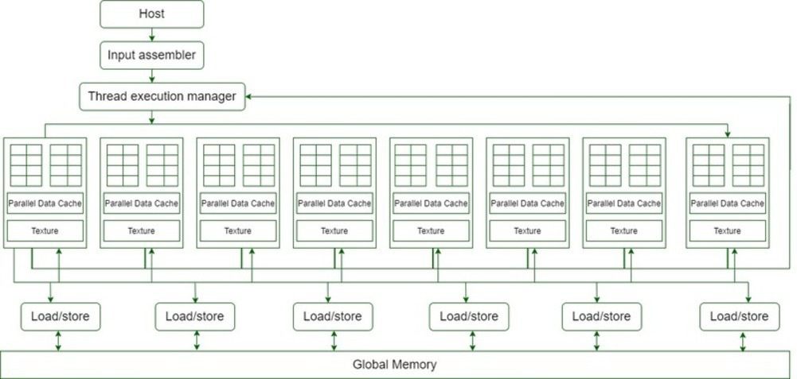
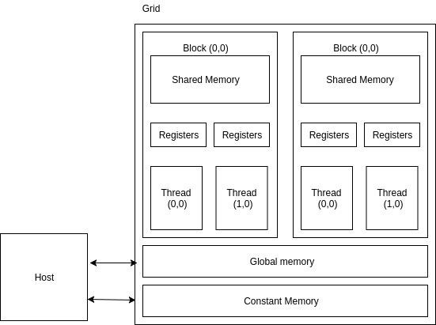
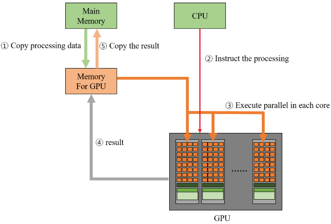

# CUDA Architecture

### Q1. Draw and explain CUDA architecture in details. [8]




## ✅ **CUDA Architecture – Explained**

**CUDA** (Compute Unified Device Architecture) is a parallel computing platform and API model developed by **NVIDIA**.
It allows the GPU to be used not only for graphics rendering but also for **general-purpose computing**, making it highly suitable for **massive parallel tasks** like deep learning, simulations, etc.

---

### 🔷 **Architecture Components:**


### **1. Host (CPU)**

* The **central processor** (CPU) of the system.
* Responsible for:

  * Managing memory allocations.
  * Launching kernel functions on the GPU.
  * Sending data to and from the GPU.
* It initiates and oversees all GPU operations.

---

### **2. Input Assembler**

* Gathers input data like vectors, matrices, or textures.
* Prepares and organizes this data for processing by GPU threads.
* Acts as a **feeder** to the thread execution system.

---

### **3. Thread Execution Manager**

* Acts as the **control center of the GPU**.
* Manages the creation, scheduling, and assignment of threads.
* Distributes threads across **Streaming Multiprocessors (SMs)**.
* Handles thread **synchronization and scheduling**, ensuring efficient execution.

---

### **4. Streaming Multiprocessors (SMs)**

Each SM is a powerful parallel processor that includes:

#### a) **Thread Blocks**

* Each SM handles multiple **thread blocks**.
* A thread block is a group of threads that execute together and share **local memory**.

#### b) **Parallel Data Cache**

* Stores frequently accessed data close to threads.
* Reduces latency by acting as a **shared memory** space.

#### c) **Texture Memory**

* Specialized memory optimized for **2D/3D spatial access patterns**.
* Frequently used in graphics and deep learning tasks.

---

### **5. Load/Store Units**

* Manage **data movement** between the global memory and SMs.
* Read and write operations are handled efficiently.
* Essential for transferring input/output data to/from memory.

---

### Q2.What is CUDA? Explain different programming languages support in CUDA. Discuss any three applications of CUDA. [8]

## ✅ **Programming Language Support in CUDA**

CUDA is designed to support a wide range of programming languages to enable developers to write parallel programs using their preferred tools. Below are the **main languages** that support CUDA development:

---

### 🔹 1. **C / C++**

* **Primary language** for CUDA programming.
* Developers write **CUDA kernels** (GPU functions) using extensions of C/C++.
* Offers direct control over **thread management**, **memory allocation**, and **synchronization**.
* Example:

  ```cpp
  __global__ void add(int *a, int *b, int *c) {
      int i = threadIdx.x;
      c[i] = a[i] + b[i];
  }
  ```

---

### 🔹 2. **Fortran**

* NVIDIA provides **CUDA Fortran**, an extension of Fortran developed in collaboration with PGI (now part of NVIDIA).
* Popular in scientific and engineering communities.
* Used for heavy numerical computations and simulations.

---

### 🔹 3. **Python**
While CUDA does not natively support Python, there are several libraries and frameworks that enable Python users to leverage GPU acceleration.
* **PyCUDA**: A Python wrapper for CUDA C/C++ APIs.
* **CuPy**: A NumPy-like library for GPU computing.
* **PyTorch**: A popular deep learning framework that supports GPU acceleration.
* Easy syntax, good for prototyping and machine learning tasks.

---

### 🔹 4. **Java**

* Although CUDA does not natively support Java, bindings are available via:

  * **JCuda**: Java bindings for CUDA runtime and driver APIs.
  * Enables Java developers to leverage GPU acceleration in high-performance computing.

---

### 🔹 5. **MATLAB**

* MATLAB supports GPU computing with built-in functions.
* Users can run CUDA kernels using **GPU Coder** to convert MATLAB code to CUDA C/C++ code.
* Suitable for data analysis, image processing, and deep learning.

---

### Q3.  Write applications of cuda. [4]

CUDA enables developers to harness the power of **thousands of cores** for high-performance computing tasks. CUDA is used across many domains due to its massive parallelism.

### **1. Scientific Simulations**

CUDA is widely used in complex scientific calculations such as Weather prediction and climate modeling

### **2. Artificial Intelligence and Machine Learning**
Used in applications like image recognition, natural language processing, and recommendation systems.

### **3. Medical Imaging**

* Fast 3D image reconstruction (MRI, CT scans)
* Enhances image processing speed and accuracy
* Used in diagnostic tools and analysis


### **4. Graphics and Rendering**

* Real-time ray tracing and high-end rendering
* Used in 3D modeling and animation software
* Game development and VFX studios

---

### **5. Image and Video Processing**

* Real-time video editing, filtering, and enhancement
* Image segmentation and transformation
* Compression/decompression tasks


---

### **6. Autonomous Vehicles**

* Real-time sensor data processing (camera, radar, LiDAR)
* Used in object detection and decision-making algorithms
* Enhances self-driving capabilities

---

### **7. Robotics**

* Real-time sensor fusion
* Parallel control of robotic arms and joints
* SLAM (Simultaneous Localization and Mapping)

---

### **8. Gaming and Virtual Reality**

* High-quality rendering
* Realistic physics simulations
* Improved gameplay and immersive experience

---

### Q4. Write advantages and limitations of CUDA. [4]

## **Advantages and Limitations of CUDA**

CUDA (Compute Unified Device Architecture) is NVIDIA’s platform for parallel computing that allows developers to use the GPU for general-purpose processing. It offers powerful capabilities, but also comes with some limitations.

---

### **Advantages of CUDA:**

1. **Massive Parallelism**

   * CUDA enables execution of thousands of threads simultaneously, leading to significant speedups in computation-heavy tasks.

2. **High Performance**

   * Optimized for NVIDIA GPUs, it delivers excellent performance in fields like AI, simulations, and image processing.

3. **Ease of Use**

   * Provides a C/C++-like programming environment, making it easier for developers to learn and implement.

4. **Wide Ecosystem Support**

   * Supported by many libraries (cuBLAS, cuDNN, Thrust, etc.) and frameworks (TensorFlow, PyTorch).

5. **Real-Time Computation**

   * Ideal for applications requiring real-time performance, such as video processing and autonomous systems.


### **Limitations of CUDA:**

1. **Hardware Dependency - NVIDIA GPUs Only**

   * CUDA only runs on NVIDIA GPUs; it does not support GPUs from other vendors like AMD.

2. **Steep Learning Curve**

   *  While syntax is easy, understanding GPU architecture - like thread, blocks, etc can be difficult for beginners.

3. **Memory Constraints**

   * GPUs typically have limited memory compared to CPUs, which can be a bottleneck for large datasets.

4. **Hardware cost**

   * NVIDIA GPUs can be expensive, which can be a barrier for some users.

5. **Overhead of Data Transfer**

   * Transferring data between CPU and GPU memory can introduce latency, especially for smaller computations.

---

### Q5. Explain CUDA memory model. Discuss thread hierarchy. [8]


### **1. CUDA Memory Model:**

- The CUDA memory model defines how memory is organized and accessed by GPU threads.
- Different memory types vary in size, speed, and accessibility.
- Each thread has access to its own local memory, and threads within a block can share a block-level shared memory.



#### **Types of Memory:**

### **i) Global Memory:**

* **Largest and slowest** memory.
* **Accessible by all threads** from all blocks.
* Located in **device memory** (outside GPU cores).
* Used for **data shared globally** across all threads.
* High latency; should be accessed carefully to avoid performance issues.

---

### **ii) Shared Memory:**

* Much **faster than global memory**.
* **Shared among threads** within the same block.
* Useful for **data exchange and reuse** among block-level threads.
* Helps minimize global memory access, improving performance.

---

### **iii) Registers:**

* **Fastest** memory type.
* **Private to each thread**.
* Used for **frequently accessed variables**.
* Very limited in size; overuse can lead to spilling into slower memory.

---

### **iv) Constant Memory:**

* **Small, read-only memory**, shared by all threads.
* Best used for **uniform values** that do not change during kernel execution.
* Faster than global memory when accessed uniformly.

---

### **v) Local Memory:**

* **Private to each thread**, but resides in **global memory**.
* Used when there are **not enough registers** or for dynamically indexed arrays.
* Despite its name, **local memory has high latency** due to its location in global memory.
* Not shared with other threads, only used by the owning thread.


### **2. Thread Hierarchy in CUDA:**

CUDA follows a hierarchical thread execution model to organize parallelism efficiently.

#### **Levels of Hierarchy:**

```
Grid
└── Blocks
    └── Threads
```

#### **Explanation:**

* **Thread:**
  The smallest unit of execution. Each thread executes the kernel code independently.

* **Thread Block (Block):**
  A group of threads (up to 1024 threads/block).
  Threads in the same block can share **shared memory** and **synchronize** using `__syncthreads()`.

* **Grid:**
  A collection of blocks.
  All blocks run independently and cannot directly communicate with each other.

---

### Q6. What is a Kernel in CUDA? What is kernel launch? Explain arguments that can be specified in a Kernel launch. [4]

## **What is a Kernel in CUDA?**

* A **Kernel** in CUDA is a function written in C/C++ that runs on the GPU.
* It is executed by many **threads in parallel**.
* Each thread runs an instance of the kernel with its own unique thread ID.
* Each thread runs the same kernal code but operates on different parts of data.


## **What is Kernel Launch?**

* **Kernel launch** refers to the process of calling or starting a kernel function on the GPU.
* When a kernel is launched, CUDA creates a large number of threads organized into **thread blocks** and **grids** to execute the kernel in parallel.
* Syntax:
    - Kernel_name <<< num_blocks, num threads-per block >>> (arguments);
    - Mykernel <<< 4, 256>>> (a,b, c)

```cpp
kernel_function<<<gridDim, blockDim, sharedMemSize, stream>>>(arguments);
```
---

## **Arguments in Kernel Launch**

When launching a kernel, you specify:

1. **Grid Dimensions (`<<<gridDim, blockDim>>>`)**

   * `gridDim`: Number of **blocks** in the grid (can be 1D, 2D, or 3D).
   * Defines how many blocks will execute the kernel.

2. **Block Dimensions (`blockDim`)**

   * Number of **threads** per block (can be 1D, 2D, or 3D).
   * Defines how many threads will run in each block.

3. **Shared Memory Size (optional)**

   * Amount of **dynamic shared memory** per block (in bytes).
   * Useful when the kernel requires extra shared memory beyond the default.

---

### Q7 Explain the following terms in CUDA: device, host, device code, Kernel. [4]

### **1. Device:**

* The **Device** refers to the **GPU (Graphics Processing Unit)**.
* It executes the **parallel portion** of the code written in CUDA.
* All **kernels** and **device code** are run on the device.

### **2. Host:**

* The **Host** refers to the **CPU (Central Processing Unit)**.
* It is responsible for **launching kernels**, **managing memory**, and **controlling execution flow**.
* The host sends data and instructions to the device.

### **3. Device Code:**

* This is the code written to run on the **GPU (device)**.
* It includes **kernels** and any functions marked with CUDA qualifiers like `__device__` or `__global__`.
* It is compiled using the **NVCC compiler** into a format that can be executed by the GPU.

### **4. Kernel:**

* A **kernel** is a **GPU function** that runs in **parallel** on many threads.
* It is launched from the host using a special syntax: `kernel_name<<<grid, block>>>(arguments);`
* Marked with the `__global__` qualifier, it executes **on the device** but is called **from the host**.

---


### Q8. Describe processing flow of CUDA-C program with diagram. [6]
(Explain how the CUDA C program executes at the kernel level with example. [8])

Unlike a traditional C pragram where all code runs on CPU, in a CUDA-c progiam, you use CPU to control pragram & GPU to perform parallel computations

## **Processing Flow of a CUDA-C Program**


1. **Host (CPU) Initialization:**

   * The program starts and runs on the host (CPU).
   * Host initializes data and allocates memory on both host and device.

2. **Data Transfer from Host to Device:**

   * Input data is copied from host memory to device global memory.
   * This step is essential because GPU works on device memory.

3. **Kernel Launch on Device (GPU):**

   * The host calls the kernel function with specified grid and block dimensions.
   * Thousands of threads execute the kernel in parallel on the GPU.

4. **Kernel Execution:**

   * GPU threads perform computations simultaneously.
   *  Each thread works on different part of data, achieving parallelism

5. **Data Transfer from Device to Host:**

   * After kernel execution, the results are copied back from device memory to host memory.

6. **Host Post-Processing and Cleanup:**

   * The host processes the results as needed.
   * Device and host memory allocations are freed.
   * Program ends.

```cpp
#include <iostream>     // For input/output

// __global__ means this function runs on GPU and is called from CPU
__global__ void add(int *a, int *b, int *c) {
    *c = *a + *b;       // Add values pointed by a and b, store in c
}

int main() {
    int a = 3, b = 4, c;          // Host (CPU) variables
    int *d_a, *d_b, *d_c;         // Device (GPU) pointers

    // Allocate memory on GPU for variables
    cudaMalloc(&d_a, sizeof(int));
    cudaMalloc(&d_b, sizeof(int));
    cudaMalloc(&d_c, sizeof(int));

    // Copy values from Host (CPU) to Device (GPU)
    cudaMemcpy(d_a, &a, sizeof(int), cudaMemcpyHostToDevice);
    cudaMemcpy(d_b, &b, sizeof(int), cudaMemcpyHostToDevice);

    // Launch the kernel on GPU with 1 block and 1 thread
    add<<<1, 1>>>(d_a, d_b, d_c);

    // Copy result back from GPU to CPU
    cudaMemcpy(&c, d_c, sizeof(int), cudaMemcpyDeviceToHost);

    // Print the result
    std::cout << "Sum = " << c << std::endl;

    // Free GPU memory
    cudaFree(d_a);
    cudaFree(d_b);
    cudaFree(d_c);

    return 0;
}

```

---


## **Diagram of CUDA-C Processing Flow**



---

### Q9. **Communication and Synchronization in CUDA**

### **1. Introduction:**

In CUDA programming, threads often execute **in parallel** and may need to **share data** or **coordinate execution**. This requires **communication** and **synchronization** mechanisms to ensure program correctness and efficiency.

---

### **2. Communication in CUDA:**

* CUDA threads **within the same block** communicate using **shared memory**.
* Each thread has **private memory** (registers and local memory).
* Threads **in the same block** can access a **shared memory space** to read/write data.
* Threads **in different blocks cannot directly communicate** during kernel execution.

#### **Example:**

In parallel reduction algorithms, **intermediate results** are shared between threads using shared memory.

---

### **3. Synchronization in CUDA:**

**Synchronization** ensures threads **wait for each other** at certain points to **avoid race conditions** and maintain **data consistency**.

---

### **4. Types of Synchronization in CUDA:**

| **Type**          | **Definition**                                                                                                                                                          |
| ----------------- | ----------------------------------------------------------------------------------------------------------------------------------------------------------------------- |
| `__syncthreads()` | Synchronizes all threads **within the same block**. Ensures all threads reach this point before continuing. Prevents data hazards in shared memory.                     |
| `__syncwarp()`    | Synchronizes threads **within a warp** (usually 32 threads). Useful when only warp-level sync is needed for better performance.                                         |
| Atomic Operations | Not explicit synchronization, but used to ensure **safe updates** to shared/global memory when multiple threads modify the same variable. Prevents **race conditions**. |

---


### Q10. What is block dimension and grid dimension in CUDA? Write a CUDA kernel for addition of two vectors and explain how it will calculate addition using threads. [6]

### 🔹 **Block Dimension (`blockDim`)**:

* Refers to the number of **threads** in a **block** (e.g., 256 threads in 1 block).
* Declared in 1D, 2D, or 3D: `dim3 blockDim(x, y, z)`.

---

### 🔹 **Grid Dimension (`gridDim`)**:

* Refers to the number of **blocks** in the **grid**.
* Allows scaling across multiple blocks on GPU.

---

### ✳️ **Each thread** has its **own unique ID**:

```cpp
int threadId = threadIdx.x + blockIdx.x * blockDim.x;
```

---

## ✅ CUDA Kernel for Vector Addition

```cpp
#include <iostream>
#define N 512

__global__ void vectorAdd(int *A, int *B, int *C, int n) {
    int i = threadIdx.x + blockDim.x * blockIdx.x;
    if (i < n) {
        C[i] = A[i] + B[i];  // Each thread adds one pair of elements
    }
}

int main() {
    int a[N], b[N], c[N];
    int *d_a, *d_b, *d_c;

    // Initialize input arrays
    for (int i = 0; i < N; i++) {
        a[i] = i;
        b[i] = i * 2;
    }

    cudaMalloc(&d_a, N * sizeof(int));
    cudaMalloc(&d_b, N * sizeof(int));
    cudaMalloc(&d_c, N * sizeof(int));

    cudaMemcpy(d_a, a, N * sizeof(int), cudaMemcpyHostToDevice);
    cudaMemcpy(d_b, b, N * sizeof(int), cudaMemcpyHostToDevice);

    // Launch kernel with (N / 256) blocks of 256 threads each
    vectorAdd<<<N / 256, 256>>>(d_a, d_b, d_c, N);

    cudaMemcpy(c, d_c, N * sizeof(int), cudaMemcpyDeviceToHost);

    for (int i = 0; i < 10; i++) {
        std::cout << a[i] << " + " << b[i] << " = " << c[i] << std::endl;
    }

    cudaFree(d_a); cudaFree(d_b); cudaFree(d_c);
    return 0;
}
```

---

### 🧠 How it Works:

1. You launch the kernel: `<<<gridDim, blockDim>>>`

   * E.g., `<<<2, 256>>>` → Total threads = `512`
2. Each thread computes **1 element** of the result vector.
3. Thread `i` calculates `C[i] = A[i] + B[i]`.

