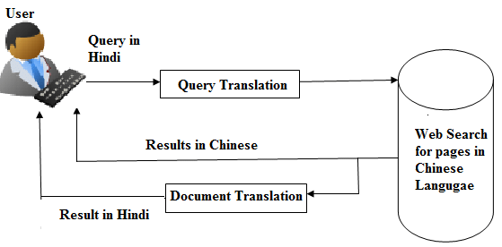

# Information Retrieval using NLP

### Q1. Describe the concept of Information Retrieval. Explain the significance of Natural Language Processing in Information Retrieval. [4]

### **Information Retrieval (IR) in Natural Language Processing (NLP)**

#### **Concept of Information Retrieval:**

Information Retrieval is the process of obtaining relevant information from large collections of unstructured data (like documents, web pages, or databases) based on a user's query. The goal is to find the most relevant documents or data that satisfy the user's information need.

**Key Steps in IR:**

1. **Document Collection** – A repository of documents (text corpus).
2. **Indexing** – Creating data structures (like inverted indexes) to make searching efficient.
3. **Query Processing** – Understanding and refining the user’s query.
4. **Ranking** – Ordering results based on relevance.
5. **Retrieval** – Displaying the most relevant results.

#### **Significance of NLP in Information Retrieval:**

NLP enhances traditional IR systems by improving understanding of human language, enabling more accurate and context-aware search results.

**Key Roles of NLP in IR:**

1. **Query Understanding** – NLP helps interpret the user’s intent through techniques like tokenization, lemmatization, and part-of-speech tagging.
2. Text Classification** – Classifies documents into categories to improve retrieval accuracy.
3. **Named Entity Recognition (NER)** – Identifies key entities (like names, locations) to improve query relevance.
4. **Question Answering** – Enables direct answers instead of listing documents (e.g., using transformers).

### **Types of Information Retrieval**:

1. **Boolean Retrieval**

   * Uses Boolean operators (AND, OR, NOT) to match exact terms in documents.
   * Simple but lacks flexibility and ranking.

2. **Vector Space Model (VSM)**

   * Represents documents and queries as vectors.
   * Calculates similarity (e.g., cosine similarity) between them for ranking.

3. **Probabilistic Retrieval**

   * Estimates the probability that a document is relevant to a given query.
   * Includes models like the BM25 ranking function.

---

### Q2.Explain the concept of the Vector Space Model and describe how it is used in Information Retrieval. [6]
### Describe the Vector Space Model (VSM) for information retrieval. How does VSM represent documents and queries, and how are similarities calculated? Discuss the strengths and weaknesses of VSM. [9]

### **Vector Space Model (VSM) – Concept and Use in Information Retrieval**

#### **Concept of Vector Space Model:**

The **Vector Space Model (VSM)** is an algebraic model for representing **text documents and queries as vectors** in a multi-dimensional space. Each dimension corresponds to a **unique term (word)** from the document collection (corpus).

* A document or query is represented as a vector of **term weights**.
* Term weights are usually computed using methods like **TF (Term Frequency)** and **TF-IDF (Term Frequency-Inverse Document Frequency)**.
* **Similarity** between a document and a query is calculated using measures like **cosine similarity**.

#### **Mathematical Representation:**

If we have a document **D** and a query **Q**, both are represented as vectors:

* **D = (d₁, d₂, ..., dₙ)**
* **Q = (q₁, q₂, ..., qₙ)**

### Cosine Similarity in Information Retrieval

### **Formula:**

$$
\text{Cosine Similarity} = \frac{A \cdot B}{\|A\| \cdot \|B\|}
$$

### **Worked Example:**

Let:

* $A = (2, 1, 1, 1, 1, 0)$
* $B = (0, 0, 0, 1, 0, 0)$

**Step 1: Dot Product (A · B)**

$$
A \cdot B = (2 \times 0) + (1 \times 0) + (1 \times 0) + (1 \times 1) + (1 \times 0) + (0 \times 0) = 1
$$

**Step 2: Magnitude of A**

$$
\|A\| = \sqrt{2^2 + 1^2 + 1^2 + 1^2 + 1^2 + 0^2} = \sqrt{8} \approx 2.646
$$

**Step 3: Magnitude of B**

$$
\|B\| = \sqrt{1} = 1
$$

**Step 4: Cosine Similarity**

$$
\text{Similarity} = \frac{1}{2.646 \times 1} \approx 0.378
$$

---

### **Interpretation:**

* A cosine similarity of **1** means the vectors are exactly the same in direction (perfectly similar).
* A cosine similarity of **0** means the vectors are orthogonal (no similarity).
* In this example, the similarity is **0.378**, indicating a low but existing similarity between the document and the query.

#### **Use in Information Retrieval:**

1. **Document Representation:**
   Each document is converted into a vector based on term frequencies or TF-IDF scores.

2. **Query Representation:**
   The user query is also turned into a vector using the same term space.

3. **Similarity Calculation:**
   Compute the similarity between the query and each document vector (e.g., using cosine similarity).

4. **Ranking:**
   Documents are ranked based on their similarity scores to the query.

5. **Retrieval:**
   Top-ranked documents are retrieved and presented to the user as search results.

---

### **Strengths of Vector Space Model (VSM):**

* Ranks documents by **relevance**.
* Supports **partial matching**.
* Uses **term weights** (e.g., TF-IDF) to improve accuracy.
* Simple and easy to **implement**.

### **Weaknesses of VSM:**

* Assumes **term independence**.
* No understanding of **word meaning** (semantics).
* **High-dimensional** and sparse vectors.
* Doesn’t handle **synonyms or polysemy**.

---

### Q3. What is Named Entity Recognition (NER)? Describe the various metrics used for evaluation. [8]
### Discuss the different methods used for evaluating NER systems. What are common metrics for measuring NER system performance, and how can the results be analyzed to improve the system? [9]

### **Definition:**

**Named Entity Recognition (NER)** is a key task in **Natural Language Processing (NLP)** that involves:

* Identifying named entities in a text.
* Classifying them into predefined categories like **Person**, **Organization**, **Location**, **Date**, **Time**, **Monetary values**, **Percentages**, etc.

---

### **Example:**

Text:

> "Apple Inc. was founded by Steve Jobs in Cupertino in 1976."

NER Output:

* **Apple Inc.** → *Organization*
* **Steve Jobs** → *Person*
* **Cupertino** → *Location*
* **1976** → *Date*

---

### **Purpose of NER:**

NER is used to extract meaningful and structured information from unstructured text. It helps:

* **Search engines** understand query intent.
* **Chatbots** recognize user names, dates, etc.
* **Information extraction** from documents (e.g., resumes, news articles).
* **Question answering** and **summarization**.

### **Challenges in NER:**

* **Ambiguity:** Same word can refer to different entity types.
  e.g., *"Apple"* (fruit or company)
* **Spelling variations** and **misspellings**.
  e.g., *"Microsft"* (Microsoft)

### **Metrics Used for Evaluation in NER:**

1. **Precision**
   Measures how many of the predicted entities are actually correct.

   $$
   \text{Precision} = \frac{\text{True Positives}}{\text{True Positives + False Positives}}
   $$

2. **Recall**
   Measures how many actual entities were correctly identified.

   $$
   \text{Recall} = \frac{\text{True Positives}}{\text{True Positives + False Negatives}}
   $$

3. **F1-Score**
   Harmonic mean of Precision and Recall.

   $$
   \text{F1} = 2 \times \frac{\text{Precision} \times \text{Recall}}{\text{Precision + Recall}}
   $$

### Evaluation Methods for NER:

4. **Exact Match (Strict Evaluation)**
   Checks whether both the **type** and **span** of the entity match exactly.

5. **Partial Match (Relaxed Evaluation)**
   Allows partial overlap in entity span (used in some cases where exact span is hard to identify).

---
### **Result Analysis & Improvement Strategies (Short):**

1. **Error Analysis** – Identify false positives/negatives to find common mistakes.
2. **Confusion Matrix** – Detect frequent misclassifications between entity types.
3. **Data Quality** – Improve annotation and add diverse training examples.
4. **Model Tuning** – Use better models (e.g., BERT) and add domain-specific knowledge.

----

### Q4. Explain the importance of entity extraction in NLP. How does entity extraction differ from named entity recognition, and provide examples of real-world applications where entity extraction is crucial. [9]

* Entity extraction is a fundamental task in Natural Language Processing (NLP) that involves identifying and extracting specific pieces of information, called **entities**, from unstructured text.
* These entities can be names of people, organizations, locations, dates, quantities, or other domain-specific terms.

* **Why is it important?**
  Because raw text is often unstructured and messy, extracting entities helps transform text into structured data that machines can understand and use effectively. This enables better information retrieval, question answering, summarization, and analytics.

### Difference Between Entity Extraction and Named Entity Recognition (NER)
| Feature                | Entity Extraction                                  | Named Entity Recognition (NER)                        |
| ---------------------- | -------------------------------------------------- | ----------------------------------------------------- |
| **Scope**              | Broad – extracts all meaningful entities           | Narrow – focuses on named entities only               |
| **Entity Types**       | Includes dates, quantities, custom/domain-specific | Typically includes PERSON, ORG, LOC, etc.             |
| **Output Granularity** | Flexible and context-dependent                     | Structured and predefined                             |
| **Customization**      | Easily customizable for domain-specific needs      | Requires training to recognize new entity types       |
| **Use Cases**          | Chatbots, knowledge graphs, semantic search        | Information extraction, summarization, classification |

**In short:**

* NER is a subtype of entity extraction focused on identifying and classifying **named entities**.
* Entity extraction can be more general, extracting both named and unnamed entities depending on the application.

---

### Examples of Real-World Applications Where Entity Extraction is Crucial

1. **Customer Support Automation:**
   Extract entities like product names, issue types, customer names, and dates from support tickets to route queries and automate responses.

2. **Healthcare:**
   Extract patient information, drug names, symptoms, and diagnoses from medical records to improve patient care and automate documentation.

3. **Legal Document Processing:**
   Extract case numbers, parties involved, dates, and legal terms to speed up contract review and case management.

5. **E-commerce:**
   Extract product attributes, brand names, prices, and user reviews to improve search relevance and personalized recommendations.

---

### Q5. Describe entity extraction and relation extraction with the help of examples.[8]

### Entity Extraction (EE)

**Definition:**
Entity Extraction is the NLP task of identifying and classifying key elements (entities) in a text into predefined categories such as person names, organizations, locations, dates, quantities, etc. The goal is to transform unstructured text into structured information by isolating these meaningful components.

**How it works:**

* The system scans the text and finds mentions of entities.
* It labels each identified entity with its type (e.g., Person, Location).

**Sentence:**
“Amazon was founded by Jeff Bezos in Seattle in 1994.”

**Entities extracted:**

* Organization: Amazon
* Person: Jeff Bezos
* Location: Seattle
* Date: 1994

### Relation Extraction (RE)

**Definition:**
Relation Extraction identifies the semantic relationships between the extracted entities in the text. After finding entities, it determines how they are connected or related.

**How it works:**

* After entities are detected, the system analyzes the sentence structure and context.
* It classifies the relationship types between entities, such as employment, founding, location, date, ownership, etc.

**Sentence:**
“Amazon was founded by Jeff Bezos in Seattle in 1994.”

* (Jeff Bezos) — **founded** —> (Amazon)
* (Amazon) — **founded in** —> (Seattle)
* (Amazon) — **founded in year** —> (1994)

### Why Both Are Important Together

* Entity extraction finds the *who, what, when, where*.
* Relation extraction reveals the *how* or *in what way* those entities connect.

| Feature        | Entity Extraction                                                                     | Relation Extraction                                                |
| -------------- | ------------------------------------------------------------------------------------- | ------------------------------------------------------------------ |
| **Definition** | Identifies and extracts entities (people, places, etc.) from text                     | Identifies and classifies relationships between extracted entities |
| **Objective**  | To detect and label entities within a text                                            | To understand how entities are connected                           |
| **Output**     | Entities like `Person`, `Location`, `Organization`                                    | Relations like `works_at`, `born_in`, `part_of`                    |
| **Focus**      | **What** the entities are                                                             | **How** the entities are related                                   |
| **Example**    | From “Barack Obama was born in Hawaii” → `Barack Obama` (Person), `Hawaii` (Location) | Relation: `born_in(Barack Obama, Hawaii)`                          |

Together, they enable building **knowledge graphs**, **question answering systems**, and **intelligent information retrieval**.

---

### Q6. What is Cross-Lingual information Retrieval, and how is it used in Natural Language Processing? Provide an example. [6]
###  Define Cross-Lingual Information Retrieval (CLIR) and discuss the challenges involved in retrieving information from languages different from the query language. How do machine translation techniques assist in CLIR? [9]

**Cross-Lingual Information Retrieval (CLIR)** is the process of retrieving relevant information written in a language different from the user’s query language.

**In simple terms:**
You ask a question or enter a search query in one language, but the system finds and returns documents or data written in another language.

### Why is it important?

* Enables access to information across language barriers.
* Useful in global research, multinational companies, and multilingual web searches.
* Helps users find knowledge that is not available in their native language.

### How Cross-Lingual Information Retrieval (CLIR) is Used in NLP

In **Natural Language Processing (NLP)**, **CLIR** enables systems to understand and match queries and documents written in different languages. It combines multiple NLP techniques like:

* **Machine Translation** – to translate queries or documents
* **Multilingual Embeddings** – to map words from different languages to a common space
* **Named Entity Recognition (NER)** – to identify important entities across languages
* **Semantic Search** – to retrieve documents based on meaning, not just keywords

### 🔍 Real-World CLIR Example (Hindi ↔ English)

**Scenario:**
A user types a query in **Hindi**, but the documents available are in **English**.

---

### **Example**

**Hindi Query:**
"भारतीय किसानों की समस्याएँ"
(*Translation: Problems of Indian farmers*)

**CLIR System Workflow:**

1. **Query Understanding:**
   Input: Hindi query → "भारतीय किसानों की समस्याएँ"

2. **Query Translation / Embedding Alignment:**
   Either:

   * Translate it to English → "Problems of Indian farmers"
     OR
   * Use multilingual embeddings to represent both Hindi and English words in a shared space.

3. **Information Retrieval:**
   Search English documents using translated query or embeddings.

4. **Document Match Found:**
   English document title:
   *"A study on challenges faced by Indian farmers in rural areas."*

5. **(Optional)**: Translate English document/snippet to Hindi for user readability.

---

### 📌 Where it's used in NLP:

* **Multilingual Search Engines** (e.g., Google search with Hindi input showing English results)
* **Digital Libraries** for bilingual research
* **Voice assistants** supporting regional queries
* **Cross-lingual chatbots** and **QA systems**

### Challenges in CLIR
* **Language Ambiguity**: Words may have multiple meanings in different languages.
* **Language-Specific Vocabulary**: Some words may not have direct translations.
* **Dictionary Differences**: Different languages have different word orders.

---

### Q7. Explain reference resolution and conference resolution with example.[8]

### 🔹 **Reference Resolution**

| Point               | Description                                                                                                               |
| ------------------- | ------------------------------------------------------------------------------------------------------------------------- |
| **1. Definition**   | Reference Resolution is the task of identifying what **entity** a word or phrase refers to in the real world or in text.  |
| **2. Goal**         | To **map references** (like pronouns or definite noun phrases) to actual entities (people, places, objects).              |
| **3. Example**      | In the sentence: “**Hariom** bought a laptop. **The device** was expensive.” – Here, "the device" refers to "laptop".     |
| **4. Types**        | Includes resolving **anaphora** (refers back) and **cataphora** (refers forward).                                         |
| **5. Applications** | Used in **question answering systems**, **dialogue systems**, and **semantic parsing** to understand user queries better. |
| **6. Challenge**    | Requires **context understanding** and sometimes **world knowledge** to accurately resolve references.                    |

---

### 🔹 **Coreference Resolution**

| Point               | Description                                                                                                                              |
| ------------------- | ---------------------------------------------------------------------------------------------------------------------------------------- |
| **1. Definition**   | Coreference Resolution is the process of identifying when **two or more expressions** in a text refer to the **same real-world entity**. |
| **2. Goal**         | To group all mentions of the **same entity** into one **coreference chain**.                                                             |
| **3. Example**      | “**Hariom** is a developer. **He** loves coding.” → "Hariom" and "He" refer to the same entity.                                          |
| **4. Applications** | Important in **machine translation**, **summarization**, and **information extraction** to avoid redundancy and improve coherence.       |
| **5. Tools**        | NLP libraries like **spaCy**, **AllenNLP**, and **Stanford CoreNLP** offer coreference resolution tools.                                 |
| **6. Challenge**    | Difficult in **long texts** or when **multiple entities** are present; needs **contextual and syntactic** understanding.                 |

---

