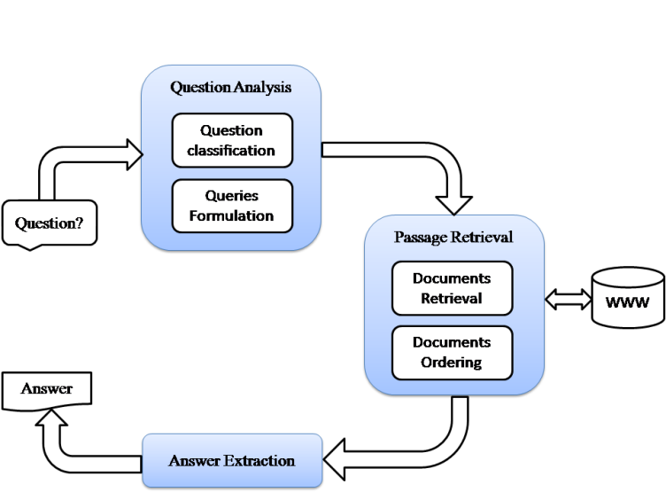

# Applications of NLP

### Q1. Explain Rule based Machine Translation and Statistical Machine Translation (SMT) with suitable diagrams and example. [10]
### Explain Statistical Machine Translation (SMT) with suitable diagrams and example. [7]
### Explain the key principles of rule-based machine translation. How do rule-based techniques differ from statistical approaches in machine translation? provide an example of a rule-based translation. [9]
## Describe various Machine Translation Approaches. [10]

### ✅ **Rule-Based Machine Translation (RBMT) – 6 Key Points for Exam**

1. **Definition**:
   * RBMT is a machine translation approach that uses **manually written linguistic rules** and **bilingual dictionaries** to convert text from a source language to a target language.
   *  It relies on predefined rules about the grammatical, syntactic, and semantic structures of both source and target languages to ensure that the translations adhere to those rules.
   * RBMT was an early approach to machine translation, and while it provides a high degree of control and predictability, it requires extensive manual effort to build and maintain. 
   * RBMT systems are built on a set of rules that govern how words are arranged, how grammar works, and how meaning is conveyed in both the source and target languages. 

2. **Process**:
   It follows three main stages:

   * **Analysis** of source language grammar
   * **Transfer** of structure and meaning
   * **Generation** in the target language

3. **Structure**:
   * **Grammar rules** are used to **identify and translate** specific grammatical structures
   * **Bilingual dictionaries** are used to **translate words**
   

4. **Example**:
   Hindi: **"राम स्कूल जाता है।"**
   English Output: **"Ram goes to school."** (using grammar rules and dictionaries)

5. **Advantages**:

   * High accuracy for **grammatically correct and formal text**
   * RBMT offers precise control over the translation process

6. **Disadvantages**:

   * **Rule creation is time-consuming and labor-intensive**
   * Struggles with **ambiguous or informal language**
   * Manual effort required for maintenance
   * Not scalable

### ✅ **Statistical Machine Translation (SMT) – 6 Key Points for Exam**

1. **Definition**:
   * SMT is a machine translation approach that uses **probability and statistics** from **bilingual corpora** to learn how to translate texts between languages.
   * SMT uses statistical models, typically based on probabilities, to determine the most likely translation of a source sentence. 


2. **Working Principle**:
   Translations are generated based on the **most likely output**, calculated using statistical models like the **language model** and **translation model**.

3. **Key Components**:
   * **Language Model**: Assesses the probability of a sentence in the target language.
   * **Translation Model**: Determines the probability of a translation given a source sentence.
   * **Alignment Model**: Aligns words between the source and target sentences.
   * **Reordering Model**: Adjusts the order of words in the target sentence.
   * **Re-ranking Model**: Refines the translation based on additional factors.


4. **Example**:
   Hindi: **"राम स्कूल जाता है।"**
   SMT translates it as: **"Ram goes to school."** based on learned probabilities from aligned corpora.

5. **Advantages**:

   * **No need for deep linguistic rules**
   * Can improve with **more data**
   * **Scalable** to large corpora
   * **Can handle ambiguity**

6. **Disadvantages**:

   * Requires **large parallel corpora**
   * May produce **grammatical errors or awkward phrasing**
   * **Can be sensitive to training data quality**

### Difference between RBMT and SMT

1. Rule-based MT uses hand-crafted linguistic rules and dictionaries, while Statistical MT relies on probability from large bilingual corpora.
2. Rule-based systems require expert knowledge; statistical systems learn patterns automatically from data.
3. RBMT is more grammatically accurate, whereas SMT may produce fluent but sometimes incorrect translations.

---

### Q2. Discuss the challenges in cross-lingual translation and provide examples of how it is beneficial in real-world applications. [8]

### ✅ **Cross-Lingual Translation – 4 Key Points**

1. **Definition**: It refers to the process of translating text or information from one language to another, especially when the source and target languages differ significantly.

2. **Goal**: Enables communication or information access between users speaking **different languages**.

3. **Approach**: Often uses machine translation systems like **Rule-Based, Statistical, or Neural MT** to perform the translation.

4. **Example**: Translating a **Hindi** question "भारत की राजधानी क्या है?" into English as **"What is the capital of India?"** for retrieval or understanding.

### ✅ **Challenges in Cross-Lingual Translation (4 Points)**

1. **Linguistic Differences**:
   Languages differ in grammar, syntax, and word order.
   *E.g.*, translating from **Hindi (SOV)** to **English (SVO)** requires structural transformation.

2. **Word Sense Ambiguity**:
   A single word may have multiple meanings based on context.
   *E.g.*, the word **"bank"** (river bank vs. financial bank) may confuse translation systems.

3. **Low-Resource Languages**:
   Lack of parallel corpora or linguistic resources makes accurate translation difficult.
   *E.g.*, translating tribal or regional Indian languages to English.

4. **Named Entity & Idiom Translation**:
   Translating names or cultural phrases can be complex.
   *E.g.*, idiom **"खून का बदला खून"** may not have an exact English equivalent.

---

### ✅ **Real-World Applications of Cross-Lingual Translation (4 Points)**

1. **Multilingual Search Engines**:
   Helps users search in their native language but retrieves results in multiple languages.
   *E.g.*, Searching in **Hindi** but retrieving content written in **English**.

2. **International Customer Support**:
   Enables support teams to understand and respond to users from different language backgrounds.

3. **Healthcare & Emergency Services**:
   Vital information translated across languages ensures safety and clarity.
   *E.g.*, Translating **COVID-19 safety guidelines** to multiple Indian languages.

4. **Education and E-Learning**:
   Makes learning resources accessible to students in regional languages.
   *E.g.*, Translating English science content into **Marathi or Tamil** for local learners.

---

### Q3.  Write a note on : Sentiment Analysis. [10]

### 📌 **What is Sentiment Analysis?**

- Sentiment Analysis (also known as **Opinion Mining**) is a **Natural Language Processing (NLP)** technique used to **identify and extract emotions, opinions, or sentiments** from text data.
- It determines whether a given text expresses a **positive, negative, or neutral** sentiment.
- It helps in understanding people's opinions, emotions, and attitudes expressed in written language
- It's often used in **social media analysis, customer feedback, and market research**.
- It's a powerful tool for businesses to understand customer feedback and opinions.

---

### 📚 **How It Works:**

1. **Text Preprocessing**

   * Cleaning text: removing stopwords, punctuation, special characters, etc.
   * Tokenization: splitting sentences into words or tokens.
   * Normalization: stemming or lemmatization.

2. **Feature Extraction**

   * Convert text into numerical features (e.g., TF-IDF, word embeddings like Word2Vec, BERT).

3. **Classification**

   * Use ML or deep learning models to classify the sentiment.
   * Common models: Naive Bayes, SVM, LSTM, BERT.

---

### 🧠 **Types of Sentiment Analysis**


### 1. **Binary Sentiment Analysis**

* **What it does**: Classifies sentiment as either **positive** or **negative**.
* **Example**:

  * **Comment**: "The phone is awesome!" → **Positive**
  * **Comment**: "Battery life is terrible." → **Negative**

---

### 2. **Ternary Sentiment Analysis**

* **What it does**: Classifies sentiment into **positive**, **negative**, or **neutral**.
* **Example**:

  * **Comment**: "The screen is fine." → **Neutral**
  * **Comment**: "Performance is great!" → **Positive**
  * **Comment**: "Camera is not good." → **Negative**

---

### 3. **Fine-grained Sentiment Analysis**

* **What it does**: Detects varying degrees of sentiment (e.g., very positive to very negative).
* **Example**: Based on **star ratings** (1 to 5 stars)

  * ⭐⭐⭐⭐⭐ → **Very Positive**
  * ⭐⭐⭐ → **Neutral**
  * ⭐ → **Very Negative**

---

### 4. **Aspect-based Sentiment Analysis**

* **What it does**: Identifies sentiment toward specific **aspects** of a product/service.
* **Example**:

  * **Comment**: "The camera is excellent, but the battery drains fast."

    * Camera → **Positive**
    * Battery → **Negative**

---

### 5. **Emotion Detection**

* **What it does**: Classifies text into **emotions** like happiness, anger, sadness, etc.
* **Example**:

  * **Comment**: "I'm thrilled with this new phone!" → **Emotion: Joy**
  * **Comment**: "I'm frustrated with the delivery delay." → **Emotion: Anger**

---

### 💡 **Example:**

**Text:**
"I love the camera quality, but the phone is too expensive."

**Sentiments:**

* Camera quality → Positive
* Price → Negative

---

### 🌍 **Applications of Sentiment Analysis**

1. **Product Reviews** – Analyze customer opinions about products on e-commerce sites.
2. **Social Media Monitoring** – Track public opinion on brands, politics, or events.
3. **Customer Service** – Detect dissatisfaction in support tickets or feedback.
4. **Market Research** – Understand public sentiment to make data-driven decisions.

---

### ✅ **Benefits**

* Helps businesses understand **customer satisfaction**.
* Supports **brand monitoring** and **crisis management**.
* Enables **automated feedback analysis** at scale.

---

### Q4. Explain three stages of Question Answering system with neat diagram.[7]

### What is a Question Answering (QA) System?

A **Question Answering system** is a type of Natural Language Processing (NLP) application designed to automatically answer questions posed by users in natural language. It processes the input question, searches for relevant information, and returns precise answers instead of a list of documents.

---

### Three Stages of a Question Answering System



1. **Question Processing**

   * Understand and analyze the user’s question.
   * Tasks include:

     * Parsing the question
     * Identifying question type (e.g., who, what, when)
     * Extracting keywords and focus points
   * Example: For "Who is the CEO of Tesla?", identify it as a “person” type question focusing on "CEO" and "Tesla."

2. **Document/Passage Retrieval**

   * Retrieve relevant documents or text passages from a knowledge base or corpus.
   * Use information retrieval techniques based on keywords and semantics.
   * Example: Search documents about Tesla to find relevant passages mentioning CEOs.

3. **Answer Extraction**

   * Extract the exact answer from the retrieved documents or passages.
   * Use techniques like Named Entity Recognition, pattern matching, or deep learning models.
   * Example: Extract the name "Elon Musk" as the answer to the CEO question.

---

### Q5. Describe following NLP applications: [10]
i) Text Entailment
ii) Dialog and Conversational Agents

### Text Entailment – 6 Key Points

1. **Definition**:
   Text entailment is an NLP task that determines whether the meaning of one text (called the **hypothesis**) can be logically inferred or is supported by another text (called the **premise**).

2. **Purpose**:
   To check if the hypothesis is **true, false, or undetermined** based on the premise.

3. **Input**:
   A pair of sentences or texts — **Premise** (source text) and **Hypothesis** (statement to verify).

4. **Output**:
   Usually a label like **Entailment** (hypothesis true), **Contradiction** (hypothesis false), or **Neutral** (cannot decide).

5. **Example**:

   * Premise: "A man is playing a guitar."
   * Hypothesis: "A person is making music." → **Entailment**

6. **Applications**:
   Used in question answering, summarization, information retrieval, and natural language inference tasks.

### Dialog and Conversational Agents Explained

### 1. **Dialog**

* **Definition**: Dialog refers to the interactive, back-and-forth exchange of messages or speech between two or more participants, often involving natural language communication.
* **Purpose**: To facilitate understanding, share information, or accomplish tasks through conversation.
* **Types**:

  * **Task-oriented Dialog**: Focused on completing specific tasks (e.g., booking tickets).
  * **Open-domain Dialog**: Casual or general conversation without a fixed goal.
* **Example**: A customer chatting with a support agent to solve a problem.

---

### 2. **Conversational Agents**

* **Definition**: Conversational agents (or chatbots) are software systems designed to simulate human-like dialogs with users, usually through text or voice interfaces.
* **Types**:

  * **Rule-based agents**: Follow predefined rules or scripts.
  * **AI-based agents**: Use NLP and machine learning for more flexible, natural conversations.
* **Purpose**: Automate interactions such as customer support, information retrieval, or personal assistance.
* **Example**: Siri, Alexa, Google Assistant.

---

### Summary

* **Dialog** is the actual interaction or conversation.
* **Conversational Agents** are the systems that manage and generate dialogs with users.

If you want, I can provide examples or architecture diagrams!

### Q7. Discuss the key components of a conversational agent, such as chatbotsor virtual assistants. How do natural language generation and understanding play a role in creating effective conversational agents? [8]

### Key Components of a Conversational Agent (Chatbots/Virtual Assistants)

1. **Natural Language Understanding (NLU)**

   * **Role**: Interprets and understands the user’s input (text or speech).
   * **Tasks**: Intent recognition, entity extraction, and context understanding.
   * **Example**: Identifying that “Book a flight to Mumbai” is a booking intent with destination “Mumbai.”

2. **Dialog Manager**

   * **Role**: Controls the flow of the conversation, manages context, and decides the next action.
   * **Example**: Asking for the date after recognizing the flight booking intent.

3. **Natural Language Generation (NLG)**

   * **Role**: Converts the agent’s responses or system outputs into natural, human-readable language.
   * **Example**: Generating replies like “Your flight to Mumbai is booked for tomorrow.”

4. **Knowledge Base / Backend System**

   * **Role**: Stores information and business logic needed to fulfill user requests.
   * **Example**: Flight schedules, user preferences, FAQs.

5. **Input/Output Interfaces**

   * **Role**: Handles user interaction through text, voice, or multimodal channels (chat, voice assistants).
   * **Example**: Chat windows, voice recognition systems.


---

### Q8. Explain Natural Language Generation with reference architecture. [7]


#### What is Natural Language Generation (NLG)?

* **NLG** is a subfield of NLP that focuses on automatically generating human-like natural language text from structured data or machine representations.
* It transforms raw data, semantic representations, or logical forms into coherent, fluent, and contextually relevant text or speech.

---

#### Key Goals of NLG:

* Produce text that is **grammatically correct**, **contextually appropriate**, and **easy to understand**.
* Convert complex data or concepts into natural language summaries, explanations, or reports.

---

### Reference Architecture of NLG System

1. **Content Determination**

   * Decide *what information* to include based on the input data or communicative goal.
   * Example: From weather data, decide to mention temperature, humidity, and forecast.

2. **Document Planning (Text Structuring)**

   * Organize the selected content logically and decide the order and structure of sentences or paragraphs.
   * Example: Group related information like temperature and humidity together.

3. **Microplanning**

   * Define how to express the planned content at the sentence level.
   * Includes choosing words (lexicalization), creating referring expressions, and deciding sentence structure (aggregation and referring).

4. **Surface Realization**

   * Convert the microplanning output into grammatically correct natural language sentences.
   * Handles syntax, morphology, and punctuation to produce fluent text.


---

### Visual Reference Architecture (Text-based)

```
Input Data → Content Determination → Document Planning → Microplanning → Surface Realization → Output Text
```

---

### Example Use Case

* Input: Weather sensor data (temperature=30°C, humidity=70%)
* Output: “Today’s weather is warm with a temperature of 30 degrees Celsius and a humidity level of 70 percent.”

---

### Q9.Define natural language generation and its role in NLP. How does NLG differ from text-to-speech synthesis, and what are the applications of NLG in data reporting and storytelling? [9]

### Natural Language Generation (NLG) — Definition and Role in NLP

**Definition:**
Natural Language Generation (NLG) is a subfield of NLP that focuses on automatically creating coherent, meaningful, and human-like text from structured data or machine-readable information.

**Role in NLP:**

* Converts raw data, numbers, or semantic representations into fluent natural language sentences.
* Bridges the gap between machine understanding and human communication by generating readable text.

---

### Difference Between NLG and Text-to-Speech (TTS) Synthesis

| Aspect   | Natural Language Generation (NLG)                       | Text-to-Speech (TTS) Synthesis        |
| -------- | ------------------------------------------------------- | ------------------------------------- |
| Output   | Generates **text** from data or meaning representations | Converts **text** into spoken audio   |
| Function | Produces natural language content                       | Produces speech from existing text    |
| Focus    | Content creation and linguistic realization             | Speech waveform synthesis and prosody |

---

### Applications of NLG in Data Reporting and Storytelling

1. **Automated Report Generation:**

   * Financial summaries, weather reports, sports updates generated automatically from data feeds.

2. **Business Intelligence:**

   * Converts analytics and dashboards into written insights for decision-makers.

3. **Personalized Storytelling:**

   * Creates personalized narratives in marketing or education based on user data.

4. **Customer Support:**

   * Generates responses or explanations based on user queries or transaction history.

---

